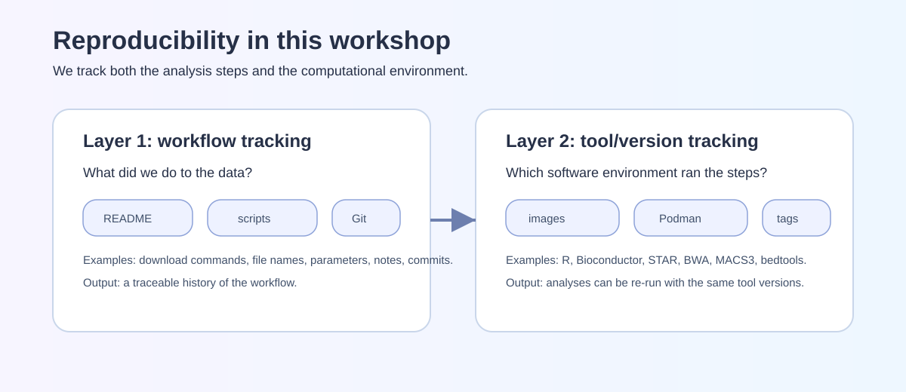
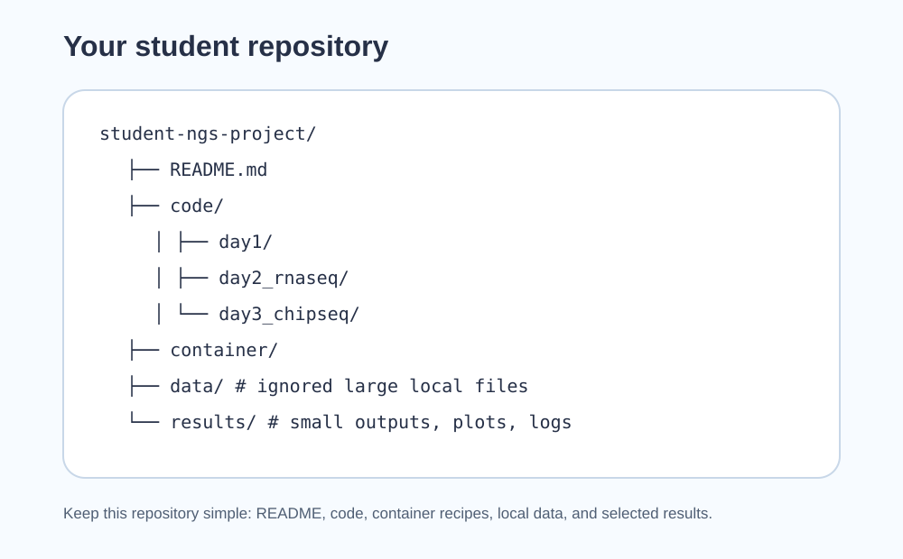
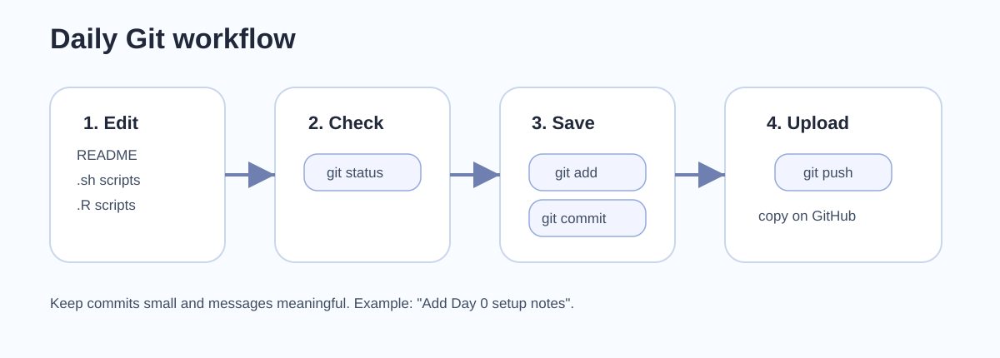
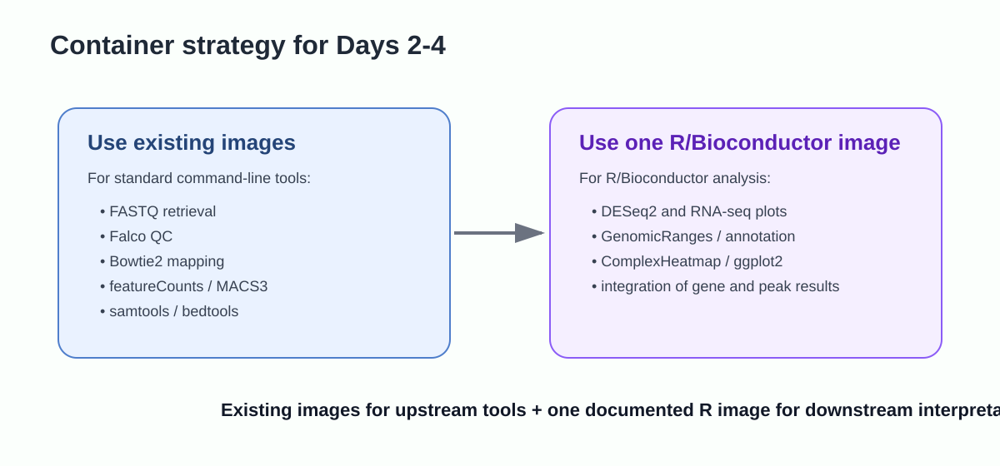

## Purpose of Day 0

Day 0 is a self-paced setup activity. By the end of this page, your computer should be ready for the practical sessions and you should have a small GitHub repository that can receive commits from your laptop.

The workshop will use small bacterial examples and checkpoint files when needed. The aim of Day 0 is not to solve every computing problem, but to identify early which execution route is realistic for your laptop.

::: {.callout-important}
**Required before Day 1.**

You should have:

1. a GitHub account;
2. a Docker Hub account;
3. Git installed and configured;
4. VS Code installed;
5. Docker Desktop or Podman Desktop installed and tested;
6. a working terminal that can run a container and mount a local folder;
7. enough free disk space for the selected execution route;
8. your own student repository created, cloned, committed, and pushed.
:::

{#fig-day0-repro-layers width="100%" fig-alt="Reproducibility layers linking project files, metadata, commands, software environment, and outputs."}

## Today's path: how your repository starts

```text
accounts and software
  -> Git identity
  -> container smoke test
  -> create GitHub repository
  -> clone locally
  -> create README, .gitignore, and simple folders
  -> first commit and push
```

## Learning outcomes

After completing Day 0, you should be able to:

- open a terminal from VS Code;
- verify that Git can communicate with GitHub;
- explain what belongs in a repository and what should stay out of version control;
- run a Docker or Podman container from your project folder;
- understand why we separate **analysis documentation** from **large sequencing data**;
- report your laptop specifications and choose an appropriate execution route.

## Conceptual background

### Reproducibility in an NGS project

An NGS analysis is reproducible only when three things are explicit:

1. **Data provenance**: which samples, accessions, reference genome, and annotation were used.
2. **Computational procedure**: which commands, scripts, parameters, and execution route were used.
3. **Software environment**: which programs and versions produced the outputs.

For this workshop, the student repository is the record of the analysis, not the storage location for heavy sequencing files. The repository should stay simple: `README.md`, `code/`, `container/`, `data/`, and `results/`. FASTQ, BAM, BAI, bigWig, SRA files, and large temporary outputs should normally be excluded by `.gitignore`.

{#fig-day0-repo-structure width="100%" fig-alt="Recommended student repository structure with README, code, container, data, and results folders."}

### What the setup tools are doing

{#fig-day0-git-github width="90%" fig-alt="Simple Git and GitHub workflow from local files to commits and remote backup."}

| Tool | Role in the workshop | What we expect you to record |
|---|---|---|
| Git | Tracks changes in text files, scripts, metadata, and small results | Meaningful commits after each practical block |
| GitHub | Stores a remote copy of your repository | A repository that can be inspected for assessment |
| VS Code | Provides editor, terminal, and repository view | Commands are run from the project root |
| Docker/Podman | Runs Linux software environments reproducibly | Image name, tag, command, and mounted folder |
| README and notes | Document analysis and interpretation | Inputs, commands, outputs, decisions, and limitations |
| IGV or genome browser | Visual inspection of genome tracks | Selected screenshots or notes, not huge track files |

A container image contains a prepared software environment. A container is a running instance of that image. The practical consequence is that students with different operating systems can run the same Linux command-line tools through a shared image.

{#fig-day0-container width="85%" fig-alt="Container concept showing host computer, mounted project folder, and reproducible software environment."}

### R and Bioconductor will run through containers

You do **not** need to install R or RStudio locally for this workshop. RNA-seq, ChIP-seq and integration steps that use R/Bioconductor will run through the course container image. This avoids differences caused by local R versions, compiler tools, package libraries and operating-system-specific installation problems.

If you already use RStudio for your own work, you may keep it installed. It is optional and not part of the required workshop setup.

The most important technical action is the **bind mount**:

```text
host project folder  <->  /work inside the container
```

This makes the same project files visible both to your laptop and to the container. All workshop commands assume that the repository root is mounted as `/work`.

::: {.callout-note}
**Supported execution routes.**

The preferred route is local Docker/Podman execution. If this fails, you may use a university Ubuntu workstation, a checkpoint-file route, or an instructor-supported backend. The assessment remains the same: document what was executed, what was provided as checkpoint data, and how the results were interpreted.
:::

## 1. Create online accounts

### 1.1 GitHub account

Create or verify your GitHub account:

```text
https://github.com/
```

During the workshop you will create your own repository, push commits, and share the repository URL for assessment.

### 1.2 Docker Hub account

Create or verify a Docker Hub account:

```text
https://hub.docker.com/
```

The course may use images from Docker Hub or another image registry. Docker Hub is useful because it is the most common registry students will encounter after the workshop.

## 2. Install VS Code

Install VS Code from:

```text
https://code.visualstudio.com/
```

Open VS Code and check that you can open a terminal:

```text
Terminal -> New Terminal
```

In the terminal, run:

```bash
pwd
```

On Windows, use the supported WSL2/Ubuntu terminal route when possible. Avoid switching between PowerShell, Git Bash, CMD, and WSL during the workshop.

## 3. Install and configure Git

### Windows

Install Git for Windows if needed, but the recommended workshop route for Windows is:

```text
Windows 10/11 + WSL2 + Ubuntu terminal + Docker Desktop
```

If using WSL2, install and configure Git inside the Ubuntu terminal.

### macOS

Check Git:

```bash
git --version
```

If it is missing, choose one of these routes:

- install the Xcode command-line tools;
- install Git from the official installer at <https://git-scm.com/download/mac>;
- use Homebrew, if Homebrew is already installed on your machine.

```bash
xcode-select --install
```

Homebrew is convenient on macOS, but it is not required for this workshop. If you already use it:

```bash
brew install git
```

### Linux

On Ubuntu/Debian:

```bash
sudo apt update
sudo apt install git
```

### Configure identity

Use the same name and email you want associated with your commits:

```bash
git config --global user.name "Your Name"
git config --global user.email "your.email@example.org"
git config --global init.defaultBranch main
```

Check:

```bash
git config --global --list
```

## 4. Install Docker Desktop or Podman Desktop

You need one working container engine. You do not need both.

| Engine | Good for | Notes |
|---|---|---|
| Docker Desktop | Most common route, good documentation | Recommended for many Windows/macOS users |
| Podman Desktop | Good Docker-compatible alternative | Often preferred where Docker licensing/admin constraints exist |

{#fig-day0-image-strategy width="90%" fig-alt="Strategy showing instructor-provided images and student repositories as separate layers."}

### Recommended resource settings

For full local execution:

| Resource | Minimum participation | Recommended full local execution |
|---|---:|---:|
| RAM | 8 GB | 16 GB or more |
| CPU | 2 cores | 4 cores or more |
| Free disk | 50 GB | 80-100 GB |

Students below the recommended specification can still complete the course using checkpoint files for the heaviest stages.

## 5. Container smoke test

Create a temporary folder:

```bash
mkdir -p ~/ngs_workshop_smoke_test
cd ~/ngs_workshop_smoke_test
echo "host file" > host_test.txt
```

Docker:

```bash
docker run --rm \
  -v "$PWD":/work \
  -w /work \
  ubuntu:24.04 \
  bash -c "cat host_test.txt && echo container_ok > container_test.txt"
```

Podman:

```bash
podman run --rm \
  -v "$PWD":/work \
  -w /work \
  docker.io/library/ubuntu:24.04 \
  bash -c "cat host_test.txt && echo container_ok > container_test.txt"
```

Back on the host:

```bash
cat container_test.txt
```

If you see `container_ok`, the container can read and write in your project directory.

::: {.callout-warning}
**Windows note.**

For Windows students, the project folder should preferably live inside the WSL2 Linux filesystem, for example under `/home/username/`, not in a synchronized cloud folder or a Windows path with spaces.
:::

## 6. Create your personal workshop repository

Create a new empty repository on GitHub, for example:

```text
ngs-workshop-student
```

Do not initialize it with large data files. Then clone it locally:

```bash
git clone https://github.com/YOUR_USERNAME/ngs-workshop-student.git
cd ngs-workshop-student
```

Create the first folders:

```bash
mkdir -p code container data results
touch code/.gitkeep container/.gitkeep data/.gitkeep results/.gitkeep
```

Create `README.md` in VS Code and paste:

```markdown
# NGS workshop student repository

This repository documents my work during the reproducible NGS workshop.

## Execution route

- Local Docker/Podman: to be confirmed
- University workstation: to be confirmed
- Checkpoint files: to be confirmed

## Dataset

To be defined during Day 1.
```

Create `.gitignore` in VS Code and paste:

```gitignore
# Large sequencing files
*.fastq
*.fq
*.fastq.gz
*.fq.gz
*.sra
*.bam
*.bai
*.sam
*.bw
*.bigWig

# Temporary and generated folders
data/raw_fastq/
data/trimmed_fastq/
data/bam/
data/genome/
data/raw_counts/
data/macs_peaks/
results/tmp/

# Local system files
.DS_Store
.Rhistory
.RData
```

Commit and push:

```bash
git add README.md .gitignore code/.gitkeep container/.gitkeep data/.gitkeep results/.gitkeep
git commit -m "Initialize workshop repository"
git push
```

## 7. Laptop-spec form

Before Day 1, communicate:

| Item | Example |
|---|---|
| Operating system | macOS Apple Silicon / macOS Intel / Windows WSL2 / Linux |
| RAM | 8 GB, 16 GB, 32 GB |
| Free disk space | approximate GB available |
| Container engine | Docker / Podman / not working yet |
| Smoke test result | passed / failed |
| GitHub repository URL | URL |
| Interest in own data | organism, assay, approximate sample number |

## 8. Minimum acceptable setup before Day 1

You are ready for Day 1 if you can show:

```bash
git status
git remote -v
```

and either:

```bash
docker run --rm hello-world
```

or:

```bash
podman run --rm docker.io/library/hello-world
```

You should also have pushed at least one commit to your GitHub repository.

## Day 0 checkpoint

By the end of Day 0, your repository should contain:

```text
README.md
.gitignore
code/
container/
data/
results/
```

Your first commit should be visible on GitHub. Keep screenshots or terminal output for any error you cannot solve; error messages are useful diagnostic information for Day 1.

## How to report issues

If you have a GitHub account, report Day 0 problems by opening an **Issue** in your student repository.

Include:

- `Day 0` and the step number in the issue title;
- your operating system;
- the command you ran;
- the exact error message;
- the relevant note or log path.

If you cannot create or access a GitHub account, email:

```text
francesco.gualdrini@gmail.com
```

Use email only for GitHub account/access problems. Use GitHub Issues for workshop technical questions whenever possible.
