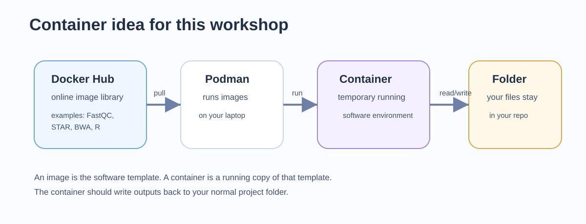

## 1. Before we start

You should have completed Day 0 and should be working from the root of your own `workshop_ngs` repository.

At the start of each practical session:

- Windows users should open Visual Studio Code connected to Ubuntu WSL, open a WSL terminal, and run the commands there.
- macOS and Linux users should open the `workshop_ngs` folder in Visual Studio Code and use the VS Code terminal.
- Before running workshop commands, move to the repository root:

```bash
cd ~/workshop_ngs
pwd
```

If your repository is stored somewhere else, replace this path with the location of your own `workshop_ngs` folder. The command `pwd` should end with `workshop_ngs`.

Day 1 contains several network-dependent download steps. We run these with small task-specific Docker images so that the software is reproducible, but the **network configuration is not part of the image**. The workshop uses Docker Desktop on both supported laptop setups: macOS, and Windows with Ubuntu/WSL2. Windows users run the commands from the **WSL2 Bash terminal**, not from PowerShell or `cmd.exe`; macOS users run them from the VS Code or system terminal. The download commands are therefore the same on both platforms.

## 2. Overview

Day 1 starts the scientific workflow and sets the working style for the rest of the workshop.

Today we will discuss:

- reproducibility in practical bioinformatics;
- repository structure: Git/GitHub, Docker/Docker Hub, scripts, metadata, logs, and outputs;
- the reference-based NGS workflow used in this workshop;
- where public raw FASTQ files and metadata are stored;
- how to prepare simple metadata for script-based downloads;
- how to download selected RNA-seq and ChIP-seq FASTQ files;
- how to download a matched reference genome and annotation and derive the BED12 gene model needed for strandedness inference;
- how to inspect compressed FASTQ files from the command line;
- how to run `fastp` for FASTQ quality assessment and trimming;
- how to inspect the `fastp` HTML/JSON reports.

This workshop follows one workflow:

```text
public data + metadata
  -> reference genome + annotation
  -> FASTQ quality assessment and preprocessing with fastp
  -> RNA-seq mapping/counting/differential expression
  -> ChIP-seq mapping/peak calling/motifs
  -> RNA-seq and ChIP-seq integration
  -> genome-browser inspection and interpretation
```

Today we retrieve the data required for Days 2, 3, and 4.

The main study is the HP1021 *Helicobacter pylori* multi-omics study:

- RNA-seq: [`E-MTAB-13025`](https://www.ebi.ac.uk/biostudies/ArrayExpress/studies/E-MTAB-13025?query=E-MTAB-13025)
- ChIP-seq: [`E-MTAB-13026`](https://www.ebi.ac.uk/biostudies/ArrayExpress/studies/E-MTAB-13026?query=E-MTAB-13026)

::: {.callout-important title="Record the RNA library design before analysis"}
The RNA-seq dataset is **rRNA-depleted, directional prokaryotic RNA-seq**, sequenced as **150-bp paired-end reads (PE150; 2 × 150 bp)**. The [publication's library-preparation methods](https://www.nature.com/articles/s41467-023-42364-6) describe rRNA removal and dUTP/USER-based strand-selective library construction. This information affects how we interpret residual rRNA and, on Day 2, which strandedness setting we use for gene counting.
:::

The full publication analysis is more complex than this teaching workflow. Our small subset captures the main logic of the published analysis, but it is simplified for laptop-scale execution.

## 3. Reproducibility in bioinformatics

Bioinformatics results depend on many linked choices:

- which public samples were used;
- which files were downloaded;
- which reference genome and annotation were used;
- which software versions ran the commands;
- which command-line options were used;
- which intermediate and final outputs were produced;
- how the outputs were interpreted.

For this workshop, three linked components define the analysis:

$$
\boxed{\text{Reproducible analysis} = \text{inputs/provenance} + \text{code/parameters} + \text{software environment}}
$$

- **Inputs/provenance:** sample and run accessions, downloaded-file checksums, and the exact reference assembly and annotation.
- **Code/parameters:** scripts, command-line options, statistical design, and thresholds.
- **Software environment:** the exact container image content, identified here by an immutable image digest.

Small outputs, logs, and interpretation notes are the evidence that connects those three components to the reported result, so we record them too.

| Project element | Reproducibility role | Commit to Git? |
|---|---|---|
| Metadata and provenance record | Defines samples, assays, conditions, replicates, accessions, input URLs/checksums, and reference identity | Yes |
| Shell script and parameter choices | Record the command logic and analysis decisions | Yes |
| Digest-pinned Docker image | Identifies the exact software environment that ran the command | Yes, record the full image reference |
| Dockerfile | Records a build recipe; live package repositories mean it does not, by itself, identify every resolved dependency | Yes |
| Log file | Records what happened when a command ran | Usually yes if small |
| FASTQ files | Large sequencing input files | No |
| Trimmed FASTQ files | Large generated intermediate files | No |
| fastp reports | Diagnostic outputs showing FASTQ quality and trimming/filtering results | Usually yes if small enough |

The important idea is simple: GitHub stores the recipe and small evidence files, not the heavy sequencing files.

## 4. Git and GitHub

Git is the local version-control system. It records changes to text files such as `README.md`, scripts, metadata, and notes. GitHub is the remote platform where you can back up and share the repository.

In this workshop, Git/GitHub are used for:

- project history;
- transparent changes to scripts and metadata;
- collaboration and troubleshooting;
- documenting what was done each day;
- submitting or sharing the final repository.

Git should not be used as storage for large sequencing data. FASTQ, BAM, BAI, bigWig, SRA files, large archives, and generated indices should be ignored.

During this lesson, we will browse to each student's GitHub account and create an empty personal repository for the workshop.

#### 4.1 Create and initialize Git locally

From the terminal, make sure you are in your local workshop folder:

```bash
cd ~/workshop_ngs
pwd
```

Initialize Git locally:

```bash
git init
git status
```

Set your Git identity if it has not already been configured on this computer:

```bash
git config --global user.name "Your Name"
git config --global user.email "your.email@example.com"
git config --global init.defaultBranch main
```

#### 4.2 Create an empty GitHub repository

Before connecting your local folder to GitHub, create an empty repository in your GitHub account.

In your browser:

1. Go to GitHub: <https://github.com/>
2. Log in.
3. Click **New repository**.
4. Use this repository name:

```text
workshop_ngs
```

5. Choose **Public** or **Private**, depending on the course instructions.
6. Do **not** add a README file.
7. Do **not** add a `.gitignore` file.
8. Do **not** add a license.
9. Click **Create repository**.

You should now see an empty GitHub repository page with a URL like:

```text
https://github.com/YOUR_USERNAME/workshop_ngs
```

Keep this page open. You will use this URL in the next terminal command.

Now connect your local folder to the empty GitHub repository. Replace `YOUR_USERNAME` with your GitHub username:

```bash
git remote add origin https://github.com/YOUR_USERNAME/workshop_ngs.git
git remote -v
```

#### 4.3 First Git commit

The first commit will be made after we create the project folders, the `.gitignore`, and a `README` file. This way Git starts by recording the intended repository structure rather than an empty folder.

The `.gitignore` file is a hidden text file that tells Git which files should not be tracked or uploaded to GitHub. In this workshop, GitHub stores the reproducible record of the analysis: scripts, metadata, notes, small tables, figures, logs, and documentation. It is not used as storage for large sequencing or alignment files.

NGS analyses often generate large FASTQ, BAM, bigWig, index, and temporary files. These files can quickly exceed practical GitHub storage limits and make repositories slow or difficult to clone. Larger project-related files are usually shared through other systems, such as institutional storage, shared drives, Zenodo, OSF, Figshare, or public sequencing archives. Those options are useful, but they are outside the scope of this workshop.

Create `.gitignore` in VS Code, or open it from the terminal:

```bash
nano .gitignore
```

Paste this content, then save and close `nano` with `Ctrl+X`, then `Y`, then `Enter`:

```bash
# OS / R
.DS_Store
.Rhistory
.RData

# Raw sequencing data
*.fastq
*.fq
*.fastq.gz
*.fq.gz
*.sra

# Alignment files
*.sam
*.bam
*.bai

# Genome tracks
*.bw
*.bigWig

# Archives
*.zip
*.tar
*.tar.gz

# Reference genome and indexes
reference_genome/*
!reference_genome/REFERENCE.md
!reference_genome/.gitkeep

# Temporary SRA files
sra_tmp/
```

You should now see `.gitignore` in the VS Code Explorer. You can open it there like any other text file to inspect or modify it.

Create a minimal `README.md` file:

```bash
nano README.md
```

Paste this content, then save and close `nano` with `Ctrl+X`, then `Y`, then `Enter`:

```bash
# Reproducible NGS workshop
```

Now make the first commit. Informally, this asks Git to take a snapshot of the small text files that define the project so far.

```bash
git status
git add .gitignore README.md
git commit -m "Initialize workshop repository"
git branch -M main
git push -u origin main
```

What these commands do:

| Command | Meaning |
|---|---|
| `git status` | Show which files are new, modified, staged, or ignored. Run this often. |
| `git add .gitignore README.md` | Choose the two small text files that should go into the first commit. |
| `git commit -m "Initialize workshop repository"` | Save the first labeled snapshot in your local Git history. |
| `git branch -M main` | Make sure the main branch is called `main`, matching the GitHub default. |
| `git push -u origin main` | Upload the first commit to GitHub and remember `origin main` as the default push target. |

## 5. Docker and Docker Hub

Docker runs software inside container images. A container image is a packaged software environment. A container is a running instance of that image.

Docker Hub is an online registry where images can be downloaded. The repository also contains simple task-specific Dockerfiles under `Docker_files/` so each image can be rebuilt if needed.


::: {.callout-note title="Docker networking and DNS on macOS and Windows/WSL2"}
A Docker **image** contains software and libraries. Networking is created later, when the image is started as a **container**.

Before `curl`, `fasterq-dump`, or any other program can contact a server such as `www.ebi.ac.uk`, the hostname must first be translated into an IP address by the **Domain Name System (DNS)**:

```text
www.ebi.ac.uk  ->  DNS lookup  ->  IP address  ->  HTTPS connection
```

If this lookup fails, the program never reaches EMBL-EBI or NCBI. For example:

```text
curl: (6) Could not resolve host: www.ebi.ac.uk
```

With Docker Desktop, containers normally use Docker's own internal DNS resolver, which forwards requests using the network configuration of the host laptop. On macOS this resolver may appear inside a container as an address such as `192.168.65.7`; on Windows/WSL2 the address can be different. **That is normal.**

For the workshop we therefore **do not specify `--dns` manually**. In particular, do not force public resolvers such as `1.1.1.1` or `8.8.8.8`: university, institutional, or VPN networks may block direct queries to them. If the laptop changes Wi-Fi or VPN, Docker Desktop may need to be restarted so that its networking layer picks up the new host configuration.

The Day 1 download images are intended to be multi-platform (`linux/amd64` and `linux/arm64`). Therefore the download commands also **do not specify `--platform`**: Docker selects the correct image automatically for Intel/AMD computers or Apple Silicon.
:::

{#fig-day1-container width="85%" fig-alt="Container concept showing host computer, mounted project folder, and reproducible software environment."}

This connects directly to reproducibility:

- Git tracks the scripts, parameters, metadata, and notes that describe what you did;
- a Docker image **digest** identifies the exact software environment that ran those scripts;
- a Dockerfile records how an image was built, but is a build recipe rather than an exact record of the resolved environment.

Image tags are useful human-readable labels, but tags such as `latest` are mutable: the same command can download different content later. Workshop commands therefore use `image@sha256:...`. The digest is long because it is a content identity, not a nickname. The release inventory is recorded in `Docker_files/images.lock.tsv` in the course repository.

Before running analysis images, we will run a small Docker test again together. This assumes that your terminal is already in the `workshop_ngs` repository root.

#### 5.1 Test Docker

Mount the whole repository into the container and write a test file back into the repository:

```bash
docker run --rm \
  -v "$PWD:/work" \
  -w /work \
  docker.io/library/alpine \
  sh -c 'echo "Hello from Docker" > test_hello.txt'

cat test_hello.txt
```

This means:

- `-v "$PWD:/work"` mounts your current repository folder inside the container as `/work`;
- `-w /work` tells the container to run from that mounted folder;
- `sh -c 'echo "Hello from Docker" > test_hello.txt'` creates a small test file from inside the container;
- the container is removed after the command finishes;
- `cat test_hello.txt` confirms that the file is visible in your repository on your computer.

## 6. Reference-based NGS analysis

This workshop uses reference-based analysis:

```text
FASTQ reads
  -> quality control and trimming
  -> alignment to a reference genome
  -> filter mapped reads
  -> sorted and indexed BAM files
  -> assay-specific analysis
      -> RNA-seq gene counts and differential expression
      -> ChIP-seq coverage tracks, peak calls, and motifs
```

The reference genome FASTA defines the coordinate system. The annotation GFF3/GTF defines gene and feature coordinates. If the FASTA and annotation come from different assemblies or use different sequence names, mapping, counting, and peak-to-gene integration can fail or silently become wrong.

This is why inputs/provenance are a separate reproducibility component: identical code, parameters, and container images can produce different coordinates and counts when the reference assembly or annotation changes.

#### 6.1 Reference genome FASTA

A FASTA file is a plain text file. Each sequence starts with a header line beginning with `>`, followed by one or more lines of DNA sequence:

```text
>chr1
ATGCGTACGTTAGCTAGCTAGCTAACGATCGATCGATCG...
CGATCGATTTAGCTAGCATCGATCGATCGTACGATCGTA...
>chr2
TTGACGATCGATCGATCGTAGCTAGCTAGCTAACGATCA...
```

For a human reference genome, headers may look like `>chr1`, `>chr2`, `>chrX`, and so on. For a bacterial genome such as *H. pylori*, there may be one main chromosome sequence and sometimes plasmid sequences. The exact names must match the annotation file. In this workshop, the chromosome name is `NZ_AP026446.1`; any different sequence accession belongs to another coordinate system and must not be mixed into the workflow.

#### 6.2 Annotation files: GFF3 and GTF

Annotation files are also plain text, but they are tab-separated tables. Each row describes one genomic feature on the FASTA coordinate system:

```text
seqid        source  type  start  end   score  strand  phase  attributes
chr1         RefSeq  gene  1000   2500  .      +       .      ID=geneA;Name=geneA
chr1         RefSeq  mRNA  1000   2500  .      +       .      ID=txA;Parent=geneA
chr1         RefSeq  exon  1000   1200  .      +       .      Parent=txA
chr1         RefSeq  exon  1800   2500  .      +       .      Parent=txA
```

The first eight columns define where the feature is. The last column stores identifiers and grouping information. In GFF3, fields such as `ID=` and `Parent=` connect features together. In GTF, the last column uses entries such as `gene_id "geneA"; transcript_id "txA";`.

::: {.callout-note title="Coordinate conventions"}
One detail that often causes confusion is coordinate convention. GFF3 and GTF use **1-based closed** coordinates: base 1 is the first base, and a feature from 1000 to 1200 includes both base 1000 and base 1200. BED files, which are common for peaks and genome-browser intervals, use **0-based half-open** coordinates: the start is counted from 0 and the end is not included.

This sounds annoying because it is. The practical rule is: do not casually copy coordinates between file formats by hand. Use tools that understand the format, such as `featureCounts`, `bedtools`, `samtools`, IGV, and Bioconductor interval classes.
:::

A eukaryotic gene with introns and exons can be represented like this:

```text
FASTA coordinate:  chr1:1000-2500

geneA on + strand

1000        1200        1800        2500
|-----------|...........|-----------|
   exon 1       intron       exon 2

GFF3 rows:
chr1  RefSeq  gene  1000  2500  .  +  .  ID=geneA;Name=geneA
chr1  RefSeq  mRNA  1000  2500  .  +  .  ID=txA;Parent=geneA
chr1  RefSeq  exon  1000  1200  .  +  .  Parent=txA
chr1  RefSeq  exon  1800  2500  .  +  .  Parent=txA
```

For *H. pylori*, the annotation is simpler because bacterial protein-coding genes usually do not have introns. A typical bacterial annotation is closer to:

```text
NZ_AP026446.1  RefSeq  gene  1500  2400  .  -  .  ID=gene-example;Name=example
NZ_AP026446.1  RefSeq  CDS   1500  2400  .  -  0  ID=cds-example;Parent=gene-example;product=example protein
```

Annotation files can be complicated to handle by hand. In this workshop, we use standard GFF3/GTF files and let tools read them for us. Aligners place reads on FASTA coordinates, `featureCounts` uses the annotation to count RNA-seq reads over genes or CDS features, and integration steps compare ChIP-seq peaks with nearby annotated genes.

For this bacterial workshop, we use matched NCBI reference genome and annotation files stored under `reference_genome/`.

#### 6.3 Download reference genome and annotation

We will first browse the reference source together:

- NCBI assembly page: [GCF_025998455.1](https://www.ncbi.nlm.nih.gov/datasets/genome/GCF_025998455.1/)
- NCBI FTP directory: [GCF_025998455.1_ASM2599845v1](https://ftp.ncbi.nlm.nih.gov/genomes/all/GCF/025/998/455/GCF_025998455.1_ASM2599845v1/)

NCBI reports this complete CHC155 RefSeq assembly as `latest` and identifies it as a reference genome. We download its chromosome `NZ_AP026446.1` as a genomic FASTA together with the matching RefSeq GFF3 and GTF annotations.

::: {.callout-important title="Reprocess from raw FASTQ"}
All workshop counts, BAM files, bigWigs, peaks, motifs, and integration tables are regenerated after mapping the raw FASTQ files to `GCF_025998455.1`. Do not reuse processed coordinates or count tables produced with another assembly.
:::

##### What is a BED12 file?

BED is a tab-separated format for describing genomic intervals. The first six BED12 columns locate and identify a feature; the final six describe how that feature is drawn and how it is divided into blocks such as exons:

```text
location and identity
chrom  chromStart  chromEnd  name  score  strand

display and block structure
thickStart  thickEnd  itemRgb  blockCount  blockSizes  blockStarts
```

| Columns | Names | Meaning in `genes.bed` |
|---|---|---|
| 1–3 | `chrom`, `chromStart`, `chromEnd` | Sequence name, 0-based inclusive start, and exclusive end boundary of the gene. |
| 4–6 | `name`, `score`, `strand` | Gene ID, placeholder score, and `+` or `-` strand. |
| 7–9 | `thickStart`, `thickEnd`, `itemRgb` | Display fields; we use the full gene interval and the default colour. |
| 10–12 | `blockCount`, `blockSizes`, `blockStarts` | Number, sizes, and relative starts of exon-like blocks. |

Most *H. pylori* genes are intron-free, so each gene is represented by one block. For example:

```text
GFF3 gene:
NZ_AP026446.1  RefSeq  gene  1500  2400  .  -  .  ID=gene-example

BED12 gene:
NZ_AP026446.1  1499  2400  gene-example  0  -  1499  2400  0  1  901  0
```

The GFF3 start `1500` becomes the 0-based BED start `1499`; the BED end remains `2400`. The final three values mean one block of length `901` starting at offset `0` from the beginning of the interval. The AWK command below performs this conversion for every GFF3 `gene` row and preserves the strand needed by RSeQC.

Create the folders needed for this step:

```bash
mkdir -p reference_genome
mkdir -p scripts/day1
```

Create the reference script: `scripts/day1/01_reference_genome_annotation.sh`:

```bash
nano scripts/day1/01_reference_genome_annotation.sh
```

Paste this script, then save and close `nano` with `Ctrl+X`, then `Y`, then `Enter`:

```bash
#!/usr/bin/env bash
set -euo pipefail

out_dir="reference_genome"
log_dir="results/logs/day1"
assembly="GCF_025998455.1_ASM2599845v1"
base_url="https://ftp.ncbi.nlm.nih.gov/genomes/all/GCF/025/998/455/${assembly}"

# Fail early if the download host cannot be reached.
echo "Checking network access to NCBI..."
if ! curl -fsS --connect-timeout 10 -o /dev/null https://ftp.ncbi.nlm.nih.gov/; then
  echo "ERROR: NCBI cannot be reached. If curl reports error 6, DNS resolution is failing." >&2
  echo "Current resolver configuration:" >&2
  cat /etc/resolv.conf 2>/dev/null || true
  exit 1
fi

mkdir -p "${out_dir}" "${log_dir}"
log_file="${log_dir}/reference_download.log"
: > "${log_file}"

echo "Downloading genome FASTA" | tee -a "${log_file}"
curl -fL "${base_url}/${assembly}_genomic.fna.gz" -o "${out_dir}/genome.fa.gz"
gzip -df "${out_dir}/genome.fa.gz"

echo "Downloading GFF3 annotation" | tee -a "${log_file}"
curl -fL "${base_url}/${assembly}_genomic.gff.gz" -o "${out_dir}/annotation.gff3.gz"
gzip -df "${out_dir}/annotation.gff3.gz"

echo "Downloading GTF annotation" | tee -a "${log_file}"
curl -fL "${base_url}/${assembly}_genomic.gtf.gz" -o "${out_dir}/annotation.gtf.gz"
gzip -df "${out_dir}/annotation.gtf.gz"

echo "Creating BED12 gene model for RSeQC" | tee -a "${log_file}"
awk -F '\t' '
BEGIN { OFS = "\t" }
$3 == "gene" {
  split($9, attributes, ";")
  sub(/^ID=/, "", attributes[1])
  bed_start = $4 - 1
  print $1, bed_start, $5, attributes[1], 0, $7, bed_start, $5, 0, 1, $5 - bed_start, 0
}
' "${out_dir}/annotation.gff3" > "${out_dir}/genes.bed"

cat > "${out_dir}/REFERENCE.md" <<EOF
# Reference genome and annotation

- Organism: Helicobacter pylori strain CHC155
- RefSeq assembly accession: GCF_025998455.1
- Assembly name: ASM2599845v1
- Chromosome accession: NZ_AP026446.1
- Primary workflow annotation: reference_genome/annotation.gff3
- Companion annotation: reference_genome/annotation.gtf
- RSeQC BED12 gene model: reference_genome/genes.bed
- Genome FASTA: reference_genome/genome.fa
- SHA-256 checksums: reference_genome/reference_files.sha256
- NCBI FTP directory: ${base_url}/
- Download script: scripts/day1/01_reference_genome_annotation.sh
- Downloaded (UTC): $(date -u '+%Y-%m-%dT%H:%M:%SZ')

All workshop reads and all derived coordinates are generated against this
assembly. Processed files from other assemblies are not compatible.
EOF

echo "Reference bundle ready in ${out_dir}" | tee -a "${log_file}"
```

#### 6.4 Read the first Bash script

Bash is a command-line interpreter: it reads commands from the terminal or from a script file and runs them in order. This reference script shows one explicit download command for each source file: the genome FASTA, GFF3 annotation, and GTF annotation. Each compressed download is decompressed immediately. The script derives the BED12 gene model needed by RSeQC, records SHA-256 checksums and the UTC download time, and writes the assembly identity to `REFERENCE.md`.

| Code part | Meaning |
|---|---|
| `#!/usr/bin/env bash` | Run this file with Bash. |
| `set -euo pipefail` | Stop if a command fails, if a variable is missing, or if part of a pipeline fails. |
| `out_dir="reference_genome"` | Store a reusable value in a variable. |
| `${out_dir}` | Use the value stored in the variable. |
| `"${out_dir}/file"` | Build a file path safely. The quotes protect paths if they contain special characters. |
| `mkdir -p` | Create a folder if needed. Do not fail if it already exists. |
| `curl -fL URL -o file` | Download a URL and save it as `file`. |
| `gzip -df file.gz` | Decompress `file.gz`, replace an older uncompressed copy if needed, and remove the `.gz` copy. |
| `awk -F '\t'` | Read the tab-separated GFF3 and select rows whose feature type is `gene`. |
| `bed_start = $4 - 1` | Convert the 1-based inclusive GFF3 start to the 0-based BED start. The GFF3 end coordinate already matches the BED end boundary. |
| `print ...` | Write the 12 BED columns required by RSeQC. Each intron-free bacterial gene is represented as one block. |

To inspect command options:

```bash
curl --help
```

```bash
gzip --help
```

#### 6.5 Check the network and run the reference download

Use the same Bash terminal for these commands on both supported platforms:

- **macOS:** VS Code terminal or Terminal;
- **Windows:** Ubuntu/WSL2 terminal with Docker Desktop WSL integration enabled.

Do not run the workshop Bash commands from PowerShell. In Bash, `$PWD` expands to the current project directory on both macOS and WSL2, so the same Docker mount works on both systems. On Windows, keep the workshop repository in the WSL2 Linux filesystem (for example `~/workshop_ngs`) rather than under `/mnt/c/...`; this avoids unnecessary filesystem overhead during large FASTQ downloads and `fasterq-dump` conversion.

Before a large download, first test the server from the laptop/WSL2 environment:

```bash
curl -I https://ftp.ncbi.nlm.nih.gov
```

Then test the same connection from the Docker image that will perform the download:

```bash
docker run --rm \
  docker.io/fgualdr/ngs-curl \
  bash -lc 'echo "DNS inside the container:"; cat /etc/resolv.conf; echo; curl -I https://ftp.ncbi.nlm.nih.gov'
```

The `nameserver` shown inside the container is normally a Docker Desktop internal address. It does **not** need to match the DNS address shown by macOS or WSL2.

If the test succeeds, run the reference download:

```bash
docker run --rm \
  -v "$PWD:/work" \
  -w /work \
  docker.io/fgualdr/ngs-curl \
  bash scripts/day1/01_reference_genome_annotation.sh
```

::: {.callout-warning title="If a download fails with 'Could not resolve host'"}
Interpret the failure in this order:

| Test | Interpretation |
|---|---|
| `curl` fails in the macOS/WSL2 terminal | The laptop, Wi-Fi, VPN, institutional proxy, or host DNS is the problem. Docker is not yet the relevant layer. |
| Host/WSL2 `curl` works, but container `curl` fails | Docker Desktop networking/DNS/proxy forwarding is the problem. |
| Both tests work | Proceed with the download script. |

Do **not** add `--dns 1.1.1.1` or `--dns 8.8.8.8` as a generic fix. These public DNS servers may be inaccessible from institutional or VPN networks.

On **macOS**, restart Docker Desktop after a Wi-Fi/VPN change and keep Docker networking/DNS on its default/automatic settings.

On **Windows/WSL2**, first verify that Docker Desktop integration is enabled for the Ubuntu distribution. If networking remains broken after a VPN or network change, restart Docker Desktop. As a stronger reset, close WSL terminals, run `wsl --shutdown` from Windows PowerShell, restart Docker Desktop, and reopen Ubuntu/WSL2.
:::

Expected outputs:

```text
reference_genome/genome.fa
reference_genome/annotation.gff3
reference_genome/annotation.gtf
reference_genome/genes.bed
reference_genome/reference_files.sha256
reference_genome/REFERENCE.md
results/logs/day1/reference_download.log
```

Before mapping, inspect the generated reference files and confirm that their sequence names agree:

```bash
grep '^>' reference_genome/genome.fa | head
grep -v '^#' reference_genome/annotation.gff3 | head
grep -v '^#' reference_genome/annotation.gtf | head
head reference_genome/genes.bed
cat reference_genome/reference_files.sha256
awk -F '\t' '{print NF; exit}' reference_genome/genes.bed
grep -v '^#' reference_genome/annotation.gff3 | wc -l
```

The BED command should print `12`, confirming that the derived gene model has the 12 columns expected by RSeQC.

## 7. From Illumina BCL files to FASTQ files

Illumina instruments image DNA clusters cycle by cycle. The instrument software converts images into base calls and quality estimates. A simplified flow is:

```text
flowcell images
  -> intensity files
  -> BCL base-call files
  -> demultiplexing by sample index
  -> per-sample FASTQ files
```

; copyright belongs to Illumina.](../assets/images/day1/Illumina_flow.png){#fig-illumina-r1-r2 width="100%" fig-alt="Illumina schematic of indexed paired-end sequencing showing Read 1, index reads, and Read 2."}

In paired-end sequencing, the same DNA fragment is read from both ends. The first sequencing read becomes read 1, usually saved as an `_R1.fastq.gz` file. After index reads identify the sample barcode, the opposite end of the same fragment is sequenced as read 2, usually saved as an `_R2.fastq.gz` file.

This means paired-end FASTQ files come in matched pairs:

```text
sample_A_R1.fastq.gz   read 1 sequences from one end of each fragment
sample_A_R2.fastq.gz   read 2 sequences from the opposite end
```

For each fragment, the R1 and R2 records should remain synchronized: record 1 in the R1 file corresponds to record 1 in the R2 file. Trimming and mapping tools therefore need both files together for paired-end data.

FASTQ files are often called "raw data" in public repositories, but they are already processed outputs of base calling and demultiplexing.

#### 7.1 FASTQ structure and read identifiers

Each FASTQ read has four lines:

```text
@read_identifier
ACGT...
+
quality_string
```

The four lines mean:

| FASTQ line | Meaning |
|---|---|
| 1 | Read identifier, usually including instrument/run/lane/tile/coordinate and sometimes read/index information |
| 2 | Called DNA sequence |
| 3 | Separator, often just `+` |
| 4 | Per-base quality string encoded as Phred quality scores |

An Illumina-style read identifier may look like:

```text
@A00488:92:H2JWNDSX3:2:1101:1234:5678 1:N:0:ATTACTCG+GTCGATTA
```

The exact format varies, but common fields include:

- instrument name;
- run number;
- flowcell ID;
- lane;
- tile;
- x/y cluster coordinates;
- read number, such as read 1 or read 2;
- filter flag;
- sample index or barcode.

Public archives may rewrite read identifiers, so do not assume every file has exactly the same format.

The quality string encodes Phred quality scores:

$$
Q = -10 \log_{10}(p)
$$

where \(p\) is the estimated probability of an incorrect base call. Q30 means an approximate error probability of 0.001.

FASTQ files may be single-end or paired-end. Paired-end libraries have read 1 and read 2 files, usually named with `_R1` and `_R2` or `_1` and `_2`. Files are usually compressed as `.fastq.gz`.

#### 7.2 Public archives we will browse together

There are several routes from a paper or accession to FASTQ files. We will look at these together in the browser:

- NCBI GEO metadata and processed data, linked to raw high-throughput sequencing reads in SRA: <https://www.ncbi.nlm.nih.gov/geo/>
- ENA Browser: <https://www.ebi.ac.uk/ena/browser/home>
- **ArrayExpress collection in BioStudies:** RNA-seq study [`E-MTAB-13025`](https://www.ebi.ac.uk/biostudies/ArrayExpress/studies/E-MTAB-13025?query=E-MTAB-13025) and ChIP-seq study [`E-MTAB-13026`](https://www.ebi.ac.uk/biostudies/ArrayExpress/studies/E-MTAB-13026?query=E-MTAB-13026)

The old ArrayExpress interface was retired in 2022 ([EMBL-EBI retirement notice](https://www.ebi.ac.uk/about/news/updates-from-data-resources/arrayexpress-retired/)). The collection now lives in BioStudies. For high-throughput sequencing studies, BioStudies provides the study record, protocols, processed files, and SDRF metadata, while the linked raw reads are brokered to ENA ([current EMBL-EBI collection guide](https://www.ebi.ac.uk/biostudies/arrayexpress/)).

The same biological run can often be reached through more than one archive. The practical difference is how we download the data:

| Route | What we usually get | Practical point |
|---|---|---|
| GEO metadata/processed layer + SRA raw-data layer | GEO series and sample records linked to SRA experiments and runs such as `SRR...` | GEO brokers raw HTS files to SRA; SRA downloads often use `fasterq-dump` and can be slow on laptops |
| ENA | direct FASTQ URLs | easier for teaching: one URL downloads one FASTQ file |
| ArrayExpress collection in BioStudies + ENA | study metadata and SDRF files in BioStudies; linked raw reads in ENA | useful for sample names, conditions, run accessions, and direct FASTQ links |

For the main workshop, we use the **ArrayExpress collection in BioStudies + ENA** route because it is easier to explain and easier to script.

#### 7.3 ArrayExpress collection in BioStudies + ENA route

For this workshop, BioStudies supplies the ArrayExpress study records and SDRF metadata; the linked ENA records supply the run accessions and FASTQ URLs that we need.

One script performs the complete retrieval step:

```text
download original SDRFs
  -> retain the WT samples
  -> add HTTPS_FASTQ_URI and FASTQ_NAME columns
  -> download and rename the FASTQ files
  -> write a metadata provenance record and log
```

The two modified metadata tables are `RNAseq_metadata.txt` and `Chipseq_metadata.txt`. They contain the sample information and FASTQ filenames used throughout the rest of the workshop.

##### Create the combined metadata and FASTQ script

Open the study pages together:

- RNA-seq: [`E-MTAB-13025`](https://www.ebi.ac.uk/biostudies/ArrayExpress/studies/E-MTAB-13025?query=E-MTAB-13025#mt-E-MTAB-13025)
- ChIP-seq: [`E-MTAB-13026`](https://www.ebi.ac.uk/biostudies/ArrayExpress/studies/E-MTAB-13026?query=E-MTAB-13026#mt-E-MTAB-13026)

Create `scripts/day1/02_download_ena_fastq.sh`:

```bash
nano scripts/day1/02_download_ena_fastq.sh
```

Paste this script:

```bash
#!/usr/bin/env bash
set -euo pipefail

mkdir -p \
  raw_data/metadata \
  raw_data/fastq/rnaseq \
  raw_data/fastq/chipseq \
  results/logs/day1

log_file="results/logs/day1/metadata_fastq_download.log"
: > "${log_file}"

# Fail early if EMBL-EBI cannot be reached.
echo "Checking network access to EMBL-EBI..." | tee -a "${log_file}"
if ! curl -fsS --connect-timeout 10 -o /dev/null https://www.ebi.ac.uk/; then
  echo "ERROR: EMBL-EBI cannot be reached. If curl reports error 6, DNS resolution is failing." >&2
  echo "Current resolver configuration:" >&2
  cat /etc/resolv.conf 2>/dev/null || true
  exit 1
fi


# -------------------------------------------------------------------------
# RNA-seq metadata
# -------------------------------------------------------------------------

echo "Downloading RNA-seq metadata" | tee -a "${log_file}"

curl -fL \
  https://ftp.ebi.ac.uk/biostudies/fire/E-MTAB-/025/E-MTAB-13025/Files/E-MTAB-13025.sdrf.txt \
  -o raw_data/metadata/E-MTAB-13025.sdrf.txt


# Keep only WT samples
grep -v "ΔHP1021" \
  raw_data/metadata/E-MTAB-13025.sdrf.txt \
  > raw_data/metadata/RNAseq_metadata.tmp


# Add two new columns:
# HTTPS_FASTQ_URI = FASTQ address converted from ftp:// to https://
# FASTQ_NAME      = simplified name such as WT_1_R1.fastq.gz

head -n 1 raw_data/metadata/RNAseq_metadata.tmp |
  sed $'s/$/\tHTTPS_FASTQ_URI\tFASTQ_NAME/' \
  > raw_data/metadata/RNAseq_metadata.txt


tail -n +2 raw_data/metadata/RNAseq_metadata.tmp |
while IFS= read -r line; do

  sample=$(printf '%s\n' "${line}" | cut -d $'\t' -f1)
  url=$(printf '%s\n' "${line}" | cut -d $'\t' -f32 | tr -d '\r')

  # ftp://... -> https://...
  url="https://${url#ftp://}"

  # ERR11479310_1.fastq.gz -> 1
  filename="${url##*/}"
  mate="${filename%.fastq.gz}"
  mate="${mate##*_}"

  # WT_1 + 1 -> WT_1_R1.fastq.gz
  fastq_name="${sample}_R${mate}.fastq.gz"

  printf '%s\t%s\t%s\n' \
    "${line}" \
    "${url}" \
    "${fastq_name}" \
    >> raw_data/metadata/RNAseq_metadata.txt

done

rm raw_data/metadata/RNAseq_metadata.tmp


# -------------------------------------------------------------------------
# ChIP-seq metadata
# -------------------------------------------------------------------------

echo "Downloading ChIP-seq metadata" | tee -a "${log_file}"

curl -fL \
  https://ftp.ebi.ac.uk/biostudies/fire/E-MTAB-/026/E-MTAB-13026/Files/E-MTAB-13026.sdrf.txt \
  -o raw_data/metadata/E-MTAB-13026.sdrf.txt


# Keep only WT samples
grep -v "ΔHP1021" \
  raw_data/metadata/E-MTAB-13026.sdrf.txt \
  > raw_data/metadata/Chipseq_metadata.tmp


# Add the HTTPS_FASTQ_URI and FASTQ_NAME columns

head -n 1 raw_data/metadata/Chipseq_metadata.tmp |
  sed $'s/$/\tHTTPS_FASTQ_URI\tFASTQ_NAME/' \
  > raw_data/metadata/Chipseq_metadata.txt


tail -n +2 raw_data/metadata/Chipseq_metadata.tmp |
while IFS= read -r line; do

  sample=$(printf '%s\n' "${line}" | cut -d $'\t' -f1)
  url=$(printf '%s\n' "${line}" | cut -d $'\t' -f31 | tr -d '\r')

  # ftp://... -> https://...
  url="https://${url#ftp://}"

  # ERR11468761_1.fastq.gz -> 1
  filename="${url##*/}"
  mate="${filename%.fastq.gz}"
  mate="${mate##*_}"

  # WT_1 + 1 -> WT_1_R1.fastq.gz
  fastq_name="${sample}_R${mate}.fastq.gz"

  printf '%s\t%s\t%s\n' \
    "${line}" \
    "${url}" \
    "${fastq_name}" \
    >> raw_data/metadata/Chipseq_metadata.txt

done

rm raw_data/metadata/Chipseq_metadata.tmp


# -------------------------------------------------------------------------
# Download RNA-seq FASTQ files
# -------------------------------------------------------------------------

echo "Downloading RNA-seq FASTQ files" | tee -a "${log_file}"

# The two new columns are columns 33 and 34
rev raw_data/metadata/RNAseq_metadata.txt |
cut -d $'\t' -f1,2 |
rev |
tail -n +2 |
while IFS=$'\t' read -r url fastq_name; do

  echo "Downloading ${fastq_name}" | tee -a "${log_file}"

  curl -fL \
    "${url}" \
    -o "raw_data/fastq/rnaseq/${fastq_name}"

done


# -------------------------------------------------------------------------
# Download ChIP-seq FASTQ files
# -------------------------------------------------------------------------

echo "Downloading ChIP-seq FASTQ files" | tee -a "${log_file}"

# The two new columns are columns 32 and 33
rev raw_data/metadata/Chipseq_metadata.txt |
cut -d $'\t' -f1,2 |
rev |
tail -n +2 |
while IFS=$'\t' read -r url fastq_name; do

  echo "Downloading ${fastq_name}" | tee -a "${log_file}"

  curl -fL \
    "${url}" \
    -o "raw_data/fastq/chipseq/${fastq_name}"

done


# -------------------------------------------------------------------------
# Record what was done
# -------------------------------------------------------------------------

cat > raw_data/metadata/METADATA.md <<EOF
# Metadata download and modification

RNA-seq metadata:
https://ftp.ebi.ac.uk/biostudies/fire/E-MTAB-/025/E-MTAB-13025/Files/E-MTAB-13025.sdrf.txt

ChIP-seq metadata:
https://ftp.ebi.ac.uk/biostudies/fire/E-MTAB-/026/E-MTAB-13026/Files/E-MTAB-13026.sdrf.txt

The metadata files were modified as follows:

- Samples carrying the ΔHP1021 genotype were excluded.
- ENA FASTQ addresses were converted from ftp:// to https://.
- A new HTTPS_FASTQ_URI column was added.
- A new FASTQ_NAME column was added.
- FASTQ names combine the sample name with the paired-end read number.

Example:

WT_1 + ERR11479310_1.fastq.gz -> WT_1_R1.fastq.gz
WT_1 + ERR11479310_2.fastq.gz -> WT_1_R2.fastq.gz

RNA-seq FASTQ files:
raw_data/fastq/rnaseq

ChIP-seq FASTQ files:
raw_data/fastq/chipseq
EOF


echo "Metadata processing and FASTQ download complete" | tee -a "${log_file}"
```

##### What each block does

| Script block | What it does |
|---|---|
| Setup | Creates the metadata, RNA-seq FASTQ, ChIP-seq FASTQ, and log folders, then starts a new log. |
| RNA-seq metadata | Downloads the original SDRF, removes `ΔHP1021` rows, reads the FASTQ URL from column 32, and adds the HTTPS URL and simplified filename. |
| ChIP-seq metadata | Performs the same operations using the FASTQ URL in column 31 of the ChIP-seq SDRF. |
| FASTQ downloads | Each loop reads the final URL and filename columns, downloads the files, and saves them under their simplified names. |
| Provenance | Writes `METADATA.md` and records progress in `metadata_fastq_download.log`. |

::: {.callout-note title="Bash walkthrough: reading and renaming one metadata row"}
This loop is worth reading slowly because it combines several Bash ideas that will reappear throughout the workshop:

```bash
tail -n +2 raw_data/metadata/Chipseq_metadata.tmp |
while IFS= read -r line; do

  sample=$(printf '%s\n' "${line}" | cut -d $'\t' -f1)
  url=$(printf '%s\n' "${line}" | cut -d $'\t' -f31 | tr -d '\r')

  url="https://${url#ftp://}"

  filename="${url##*/}"
  mate="${filename%.fastq.gz}"
  mate="${mate##*_}"

  fastq_name="${sample}_R${mate}.fastq.gz"

  printf '%s\t%s\t%s\n' \
    "${line}" \
    "${url}" \
    "${fastq_name}" \
    >> raw_data/metadata/Chipseq_metadata.txt

done
```

| Bash code | What it means here |
|---|---|
| `tail -n +2 file` | Print the file starting from line 2. The header is skipped, so the loop processes only sample rows. |
| `\|` | A **pipe**: send the output of the command on the left directly to the command on the right. |
| `while ...; do ... done` | Repeat the commands between `do` and `done` once for every input row. |
| `IFS= read -r line` | Read one complete row into the variable `line`. `IFS=` prevents Bash from splitting the row on spaces; `-r` prevents backslashes from being interpreted. |
| `${line}` | Use the value stored in the variable `line`. The quotes in `"${line}"` prevent unwanted word splitting or wildcard expansion. |
| `$(command)` | **Command substitution**: run `command` and store its output. For example, `sample=$(...)` stores the extracted sample name in `sample`. |
| `printf '%s\n' "${line}"` | Print the row exactly as a string followed by a newline. `%s` means “insert a string”; `\n` means newline. `printf` is preferred over `echo` when exact text handling matters. |
| `cut -d $'\t' -f1` | Split the row using a **tab** as the delimiter (`-d $'\t'`) and extract field 1 (`-f1`): here, the sample name. `$'\t'` is Bash syntax for one literal tab character. |
| `cut -d $'\t' -f31` | Split on tabs and extract field 31: here, the ChIP-seq FASTQ URL. RNA-seq uses `-f32` because its SDRF has a different column layout. |
| `tr -d '\r'` | Remove carriage-return characters (`\r`) that can occur in text files with Windows-style line endings. |
| `url="https://${url#ftp://}"` | Bash parameter expansion. `${url#ftp://}` removes `ftp://` from the beginning of the string, then `https://` is added. |
| `filename="${url##*/}"` | Remove everything through the last `/`, leaving only the filename, e.g. `ERR11468761_1.fastq.gz`. |
| `mate="${filename%.fastq.gz}"` | Remove the suffix `.fastq.gz`. |
| `mate="${mate##*_}"` | Remove everything through the last `_`, leaving the mate number, e.g. `1` or `2`. |
| `fastq_name="${sample}_R${mate}.fastq.gz"` | Build a new filename by combining variables and literal text, e.g. `WT_1_R1.fastq.gz`. |
| `printf '%s\t%s\t%s\n' ...` | Print three strings separated by tabs (`\t`) and finish with a newline. This creates one new TSV row. |
| `\` at the end of a line | Continue the same shell command on the next physical line. It is only for readability. |
| `>> file` | **Append** output to a file. In contrast, `> file` overwrites the file. |

For example:

```text
sample   = WT_1
url      = ftp://.../ERR11468761_1.fastq.gz
filename = ERR11468761_1.fastq.gz
mate     = 1
result   = WT_1_R1.fastq.gz
```
:::

::: {.callout-tip title="Other Bash syntax used in the download script"}
| Bash code | Meaning |
|---|---|
| `#!/usr/bin/env bash` | Run the script with the Bash interpreter found in the current environment. |
| `set -euo pipefail` | Stop on command errors (`-e`), undefined variables (`-u`), and failures inside pipelines (`pipefail`). This makes scripts fail early instead of silently continuing. |
| `mkdir -p directory` | Create a directory and any missing parent directories; do not fail if it already exists. |
| `: > file` | Create an empty file or truncate an existing one. Here it starts a fresh log. |
| `echo "message" \| tee -a log` | Show a message on screen and append the same message to a log file. |
| `curl -fL URL -o file` | Download `URL`; `-f` reports HTTP errors, `-L` follows redirects, and `-o` specifies the output filename. |
| `grep -v "pattern" file` | Print every line **except** those matching `pattern`. |
| `head -n 1 file` | Print only the first line, here the metadata header. |
| `sed $'s/$/\t.../'` | Append text to the end of a line; `\t` inserts tab characters. |
| `rm file` | Remove a temporary file once it is no longer needed. |
| `rev file \| cut -d $'\t' -f1,2 \| rev` | Reverse each line, explicitly split on tabs, select fields 1 and 2, then reverse them back. Because the line was reversed first, these correspond to the original last two columns. |
| `cat > file <<EOF ... EOF` | Write a multi-line block of text to a file. This construct is called a **here-document**. |
:::

The two FASTQ-download blocks then use the same logic: select the final URL and filename columns, skip the header, read one URL/name pair at a time, and let `curl` save each file under the chosen local name.

##### Check the EBI connection and run the script

The ArrayExpress/ENA route uses `curl` inside the `ngs-curl` image. The command is identical from macOS Bash and Ubuntu/WSL2 Bash.

First test EBI from inside the image:

```bash
docker run --rm \
  docker.io/fgualdr/ngs-curl \
  bash -lc 'echo "DNS inside the container:"; cat /etc/resolv.conf; echo; curl -I https://www.ebi.ac.uk'
```

If the test succeeds, run the complete metadata + FASTQ download:

```bash
docker run --rm \
  -v "$PWD:/work" \
  -w /work \
  docker.io/fgualdr/ngs-curl \
  bash scripts/day1/02_download_ena_fastq.sh
```

Here Docker selects the correct image architecture automatically. `-v "$PWD:/work"` mounts the current workshop repository as `/work` inside the container, and `-w /work` makes that mounted directory the working directory. The files written by the script therefore appear directly in your local `raw_data/` folder.

Inspect the final URL and filename columns, downloaded files, provenance note, and log:

```bash
rev raw_data/metadata/RNAseq_metadata.txt | cut -d $'\t' -f1,2 | rev | head
rev raw_data/metadata/Chipseq_metadata.txt | cut -d $'\t' -f1,2 | rev | head
ls -lh raw_data/metadata/RNAseq_metadata.txt
ls -lh raw_data/metadata/Chipseq_metadata.txt
ls -lh raw_data/metadata/METADATA.md
ls -lh raw_data/fastq/rnaseq/*.fastq.gz
ls -lh raw_data/fastq/chipseq/*.fastq.gz
cat results/logs/day1/metadata_fastq_download.log
```

The current WT metadata contain three biological replicates in each of two conditions. Each FASTQ folder should therefore contain twelve files: R1 and R2 for six samples. Keep the original SDRFs as downloaded provenance records; use `RNAseq_metadata.txt` and `Chipseq_metadata.txt` in the subsequent workshop steps.

##### Inspect the downloaded FASTQ files

Look inside one compressed FASTQ file manually. Choose one RNA-seq R1 file that exists in your folder:

```bash
zcat raw_data/fastq/rnaseq/WT_1_R1.fastq.gz | head
```

or on OSX use gzcat
```bash
gzcat raw_data/fastq/rnaseq/WT_1_R1.fastq.gz | head
```

You should see repeated four-line FASTQ records. The first line of each record is the read identifier, the second line is the sequence, the third line starts with `+`, and the fourth line contains the quality scores.

For paired-end data, each read in the R1 file should have a matching read in the R2 file. Copy one read identifier from the first line of the R1 output. You only need the shared identifier before any `/1`, `/2`, or read-specific suffix.

We can check the pairing logic and read ID structure manually:
Copy one read identifier from a line starting with `@` in read1, then search for the same identifier in the matching R2 file. Replace `PASTE_READ_ID_HERE` with the identifier you copied:

```bash
zcat raw_data/fastq/rnaseq/WT_1_R2.fastq.gz | grep 'PASTE_READ_ID_HERE'
```
or on OSX use gzcat
```bash
gzcat raw_data/fastq/rnaseq/WT_1_R2.fastq.gz | grep 'PASTE_READ_ID_HERE'
```

If the pair is present, `grep` should print the matching R2 read header. This is a useful sanity check that the R1 and R2 files belong together. Read-identifier formats can differ between sequencing platforms and archive-processing routes.

#### 7.4 Optional GEO/SRA route: retrieve the same data with `fasterq-dump`

The previous section retrieved metadata from the **ArrayExpress collection in BioStudies** and downloaded the linked FASTQ files directly from ENA URLs. Here we retrieve the same type of raw sequencing data through the **SRA Toolkit** instead.

The two routes are complementary:

| Route | Metadata | Raw reads |
|---|---|---|
| BioStudies / ArrayExpress + ENA | SDRF tables | direct FASTQ URLs with `curl` |
| GEO / SRA | SRA/INSDC run metadata | run accessions with `fasterq-dump` |

GEO is often the entry point for a sequencing study: a GEO series (`GSE...`) contains samples (`GSM...`) that link to SRA experiments and runs. Other repositories, including BioStudies/ArrayExpress, can also link to the same underlying public sequencing archives. For downloading reads, the important identifier is the **run accession**: `SRR...`, `ERR...`, or `DRR...`.

```text
study / sample metadata
        |
        v
SRA / ENA run metadata
        |
        +--> run accession: SRR... / ERR... / DRR...
                              |
                              v
                        fasterq-dump
                              |
                              v
                            FASTQ
```

The SRA file itself contains the sequence data, not the biological sample metadata. We therefore first download a small run-metadata table, select the samples that we want, and define the filenames that we want locally. We then use each run accession with `fasterq-dump`.

For simplicity, this example uses the ENA Portal API to obtain a small tab-separated run table from the shared INSDC records. The sequence data are then retrieved with the NCBI SRA Toolkit. The same run accessions describe the same public runs across SRA/ENA/DRA.

We will retrieve **both workshop datasets** in one script:

- RNA-seq: `ERP147707`
- ChIP-seq: `ERP147583`

To make the two retrieval methods easy to compare, the SRA example uses a parallel directory called `raw_data_sra/` with the same internal organization used in Section 7.3:

```text
raw_data_sra/
├── metadata/
│   ├── RNAseq_metadata_all.tsv
│   ├── RNAseq_metadata.txt
│   ├── Chipseq_metadata_all.tsv
│   └── Chipseq_metadata.txt
└── fastq/
    ├── rnaseq/
    └── chipseq/
```

If this were the only retrieval route used for the project, we could simply change `root="raw_data_sra"` to `root="raw_data"` and the downstream folder structure would be identical to Section 7.3.

##### Create the SRA metadata and FASTQ script

Create:

```bash
nano scripts/day1/04_download_sra_fastq.sh
```

Paste:

```bash
#!/usr/bin/env bash
set -euo pipefail

root="raw_data_sra"

mkdir -p \
  "${root}/metadata" \
  "${root}/fastq/rnaseq" \
  "${root}/fastq/chipseq"

# Metadata come from EMBL-EBI; sequencing runs are retrieved through SRA.
echo "Checking network access to EMBL-EBI and NCBI..."
for url in https://www.ebi.ac.uk/ https://www.ncbi.nlm.nih.gov/; do
  if ! curl -fsS --connect-timeout 10 -o /dev/null "${url}"; then
    echo "ERROR: ${url} cannot be reached. If curl reports error 6, DNS resolution is failing." >&2
    echo "Current resolver configuration:" >&2
    cat /etc/resolv.conf 2>/dev/null || true
    exit 1
  fi
done


# -------------------------------------------------------------------------
# RNA-seq metadata
# -------------------------------------------------------------------------

rnaseq_study="ERP147707"

curl -fL \
  "https://www.ebi.ac.uk/ena/portal/api/filereport?accession=${rnaseq_study}&result=read_run&fields=run_accession,sample_title,library_layout&format=tsv" \
  -o "${root}/metadata/RNAseq_metadata_all.tsv"

# Keep WT_1-3 and WTS_1-3 and add the local FASTQ prefix
awk -F $'\t' 'BEGIN {OFS="\t"}
NR==1 {print $1,$2,$3,"FASTQ_PREFIX"; next}
$2 ~ /^(WT|WTS)_[123]$/ {print $1,$2,$3,$2}
' "${root}/metadata/RNAseq_metadata_all.tsv" \
  > "${root}/metadata/RNAseq_metadata.txt"


# -------------------------------------------------------------------------
# ChIP-seq metadata
# -------------------------------------------------------------------------

chipseq_study="ERP147583"

curl -fL \
  "https://www.ebi.ac.uk/ena/portal/api/filereport?accession=${chipseq_study}&result=read_run&fields=run_accession,sample_title,library_layout&format=tsv" \
  -o "${root}/metadata/Chipseq_metadata_all.tsv"

# Keep WT_1-3 and WTS_1-3 and add the local FASTQ prefix
awk -F $'\t' 'BEGIN {OFS="\t"}
NR==1 {print $1,$2,$3,"FASTQ_PREFIX"; next}
$2 ~ /^(WT|WTS)_[123]$/ {print $1,$2,$3,$2}
' "${root}/metadata/Chipseq_metadata_all.tsv" \
  > "${root}/metadata/Chipseq_metadata.txt"


# -------------------------------------------------------------------------
# Download RNA-seq FASTQ files
# -------------------------------------------------------------------------

tail -n +2 "${root}/metadata/RNAseq_metadata.txt" |
while IFS=$'\t' read -r run sample layout prefix; do

  echo "Downloading RNA-seq ${sample} (${run}); layout=${layout}; threads=4"

  if [[ "${layout}" == "PAIRED" ]]; then
    fasterq-dump "${run}" --split-files --threads 4 --progress --details --outdir "${root}/fastq/rnaseq"

    mv "${root}/fastq/rnaseq/${run}_1.fastq" "${root}/fastq/rnaseq/${prefix}_R1.fastq"
    mv "${root}/fastq/rnaseq/${run}_2.fastq" "${root}/fastq/rnaseq/${prefix}_R2.fastq"

    gzip "${root}/fastq/rnaseq/${prefix}_R1.fastq"
    gzip "${root}/fastq/rnaseq/${prefix}_R2.fastq"

  else
    fasterq-dump "${run}" --threads 4 --progress --details --outdir "${root}/fastq/rnaseq"

    mv "${root}/fastq/rnaseq/${run}.fastq" "${root}/fastq/rnaseq/${prefix}_R1.fastq"
    gzip "${root}/fastq/rnaseq/${prefix}_R1.fastq"
  fi

done


# -------------------------------------------------------------------------
# Download ChIP-seq FASTQ files
# -------------------------------------------------------------------------

tail -n +2 "${root}/metadata/Chipseq_metadata.txt" |
while IFS=$'\t' read -r run sample layout prefix; do

  echo "Downloading ChIP-seq ${sample} (${run}); layout=${layout}; threads=4"

  if [[ "${layout}" == "PAIRED" ]]; then
    fasterq-dump "${run}" --split-files --threads 4 --progress --details --outdir "${root}/fastq/chipseq"

    mv "${root}/fastq/chipseq/${run}_1.fastq" "${root}/fastq/chipseq/${prefix}_R1.fastq"
    mv "${root}/fastq/chipseq/${run}_2.fastq" "${root}/fastq/chipseq/${prefix}_R2.fastq"

    gzip "${root}/fastq/chipseq/${prefix}_R1.fastq"
    gzip "${root}/fastq/chipseq/${prefix}_R2.fastq"

  else
    fasterq-dump "${run}" --threads 4 --progress --details --outdir "${root}/fastq/chipseq"

    mv "${root}/fastq/chipseq/${run}.fastq" "${root}/fastq/chipseq/${prefix}_R1.fastq"
    gzip "${root}/fastq/chipseq/${prefix}_R1.fastq"
  fi

done
```

The script deliberately repeats the RNA-seq and ChIP-seq blocks. This is slightly longer than writing a Bash function, but it makes the workflow easier to read when learning Bash: **metadata -> sample selection -> FASTQ download -> renaming** is visible independently for each experiment.

::: {.callout-note title="Bash walkthrough: downloading and selecting the metadata"}
The first two blocks do the same job for RNA-seq and ChIP-seq.

| Bash code | What it does |
|---|---|
| `root="raw_data_sra"` | Store the root output directory in one variable. All SRA-derived files are written below this directory. |
| `mkdir -p ...` | Create the metadata, RNA-seq FASTQ, and ChIP-seq FASTQ directories. `-p` also creates missing parent directories and does not fail if they already exist. |
| `rnaseq_study="ERP147707"` | Store the RNA-seq study accession in a variable. |
| `${rnaseq_study}` | Insert the value stored in the variable into the URL. |
| `curl -fL URL -o file` | Download the metadata table. `-f` makes HTTP errors fail, `-L` follows redirects, and `-o` gives the downloaded file a local name. |
| `fields=run_accession,sample_title,library_layout` | Ask the metadata service to return only the three columns needed for this exercise. |
| `awk -F $'\t'` | Read the table using a tab as the field delimiter. `$'\t'` is Bash syntax for one literal tab character. |
| `BEGIN {OFS="\t"}` | Tell `awk` to also separate output columns with tabs. |
| `NR==1 {...; next}` | Process the first row as the header, then move directly to the next row. |
| `$1`, `$2`, `$3` | In `awk`, these mean column 1, column 2, and column 3. Here they correspond to run accession, sample title, and library layout. |
| `$2 ~ /^(WT\|WTS)_[123]$/` | Keep only sample names `WT_1`-`WT_3` and `WTS_1`-`WTS_3`. |
| `print $1,$2,$3,$2` | Write the three original columns plus the sample name again as `FASTQ_PREFIX`. This fourth column defines the filename we want locally. |
| `>` | Write the command output to a new file. |
:::

After this step, the selected metadata have a deliberately small structure:

```text
run_accession    sample_title    library_layout    FASTQ_PREFIX
ERR...           WT_1            PAIRED             WT_1
ERR...           WT_2            PAIRED             WT_2
...
```

The first column tells SRA Toolkit **what to download**. The last column tells our script **what to call the FASTQ file locally**.

::: {.callout-note title="Bash walkthrough: downloading and renaming FASTQ files"}
The download loop reads one selected metadata row at a time.

| Bash code | What it does |
|---|---|
| `tail -n +2 file` | Start from line 2 so that the header is skipped. |
| `|` | Pipe the rows produced by `tail` into the `while` loop. |
| `while IFS=$'\t' read -r run sample layout prefix; do` | Read four tab-separated columns into four Bash variables. |
| `echo "...${sample}...${run}..."` | Print which biological sample and archive run are currently being processed. |
| `if [[ "${layout}" == "PAIRED" ]]; then` | Use the paired-end branch when the metadata say that the library layout is `PAIRED`. |
| `fasterq-dump "${run}" --split-files --threads 4 --progress --details --outdir ...` | Retrieve the run and convert it to FASTQ. `--split-files` writes read 1 and read 2 separately; `--threads 4` makes the amount of parallel work explicit; `--progress` prints progress bars for the conversion stages; `--details` prints additional status information so a long download/conversion does not look frozen. |
| `${run}_1.fastq`, `${run}_2.fastq` | Default archive-based FASTQ names produced for a paired-end run. |
| `mv old new` | Rename an archive-based file to the biological sample name used in the workshop. |
| `${prefix}_R1.fastq` | Construct a filename such as `WT_1_R1.fastq`. |
| `gzip file` | Compress the FASTQ file, producing `.fastq.gz`. |
| `else` | Use the alternative branch for a single-end library. |
| `${prefix}_R1.fastq` for single-end data | We still use `_R1` for the only read file so that filenames follow one consistent convention throughout the workshop. |
| `fi` | End the `if` statement. |
| `done` | End the loop after all selected runs have been processed. |

For a workshop laptop we use **4 threads explicitly** rather than relying on the program default. More threads are not necessarily faster because `fasterq-dump` can become limited by network or disk I/O. The `--progress` and `--details` options are pedagogically useful here: SRA retrieval and FASTQ conversion can take several minutes, and visible stage/progress messages make it clear that the command is still working.
:::

##### Check EBI/NCBI and run the complete SRA route

This route uses one image for two network operations:

```text
curl              -> retrieve the small run-metadata tables
fasterq-dump       -> retrieve each sequencing run and convert it to FASTQ
```

The same command is used on macOS and Windows/WSL2. Because `ngs-sra-tools` is a multi-platform image, do **not** force `--platform linux/amd64`; Docker chooses `linux/arm64` on Apple Silicon and `linux/amd64` on Intel/AMD systems automatically.

Before downloading the data, test both repositories and verify that `fasterq-dump` is available:

```bash
docker run --rm \
  docker.io/fgualdr/ngs-sra-tools:latest \
  bash -c '
    echo "DNS inside the container:"
    cat /etc/resolv.conf
    echo
    echo "Testing EMBL-EBI..."
    curl -I https://www.ebi.ac.uk
    echo
    echo "Testing NCBI..."
    curl -I https://www.ncbi.nlm.nih.gov
    echo
    echo "SRA Toolkit:"
    command -v fasterq-dump
    fasterq-dump --version
  '
```

If these tests succeed, run the complete SRA route:

```bash
docker run --rm \
  -v "$PWD:/work" \
  -w /work \
  docker.io/fgualdr/ngs-sra-tools:latest \
  bash scripts/day1/04_download_sra_fastq.sh
```

One execution retrieves the metadata and downloads the selected **RNA-seq and ChIP-seq** runs. `fasterq-dump` performs the SRA sequence retrieval and FASTQ conversion; the script then renames and compresses the files according to the workshop naming scheme.

::: {.callout-note title="Same Docker command on macOS and Windows/WSL2"}
Run the command from the repository root in a **Bash** terminal:

```text
macOS                  -> VS Code terminal / Terminal
Windows + Docker       -> Ubuntu WSL2 terminal
```

In both cases:

```bash
-v "$PWD:/work" -w /work
```

means “mount my current workshop directory inside the container as `/work`, then run from `/work`.” This is why the scripts and downloaded files are visible both inside the container and on the laptop.
:::

::: {.callout-warning title="DNS troubleshooting for SRA downloads"}
A `curl: (6) Could not resolve host` message or an SRA Toolkit hostname-resolution error indicates a network/DNS problem, not a problem with the run accession or the FASTQ-renaming code.

Use Docker Desktop's normal DNS forwarding first; **do not add a fixed `--dns` option to the workshop command**. If the macOS/WSL2 terminal can reach EBI/NCBI but the container cannot, restart Docker Desktop and check VPN/proxy/WSL integration as described in Section 6.5.
:::

##### Inspect the metadata

```bash
head raw_data_sra/metadata/RNAseq_metadata_all.tsv
cat raw_data_sra/metadata/RNAseq_metadata.txt

head raw_data_sra/metadata/Chipseq_metadata_all.tsv
cat raw_data_sra/metadata/Chipseq_metadata.txt
```

##### Inspect the downloaded FASTQ files

```bash
ls -lh raw_data_sra/fastq/rnaseq/
ls -lh raw_data_sra/fastq/chipseq/
```

The final filenames should follow the same biological naming convention used by the ArrayExpress/ENA route, for example:

```text
raw_data_sra/fastq/rnaseq/WT_1_R1.fastq.gz
raw_data_sra/fastq/rnaseq/WT_1_R2.fastq.gz

raw_data_sra/fastq/chipseq/WT_1_R1.fastq.gz
raw_data_sra/fastq/chipseq/WT_1_R2.fastq.gz
```

This gives us two different retrieval mechanisms but the same logical project organization:

```text
ArrayExpress / ENA route                SRA Toolkit route
-------------------------                -----------------
raw_data/metadata/                       raw_data_sra/metadata/
raw_data/fastq/rnaseq/                   raw_data_sra/fastq/rnaseq/
raw_data/fastq/chipseq/                  raw_data_sra/fastq/chipseq/
WT_1_R1.fastq.gz                         WT_1_R1.fastq.gz
WT_1_R2.fastq.gz                         WT_1_R2.fastq.gz
```

::: {.callout-note title="Why teach both routes?"}
The biological data are the same, but the retrieval logic is different. The ArrayExpress/ENA route teaches students how to work from metadata containing direct FASTQ URLs. The SRA route teaches them how to work from **run accessions**, where `fasterq-dump` performs the sequence download and FASTQ conversion. In both cases, good practice is the same: inspect metadata first, select the required samples explicitly, retain the original archive identifiers, and rename files to meaningful local names.
:::

::: {.callout-warning title="Storage"}
`fasterq-dump` writes uncompressed FASTQ files before `gzip` compresses them and can also require temporary working space. Public sequencing runs can therefore require substantially more free disk space during retrieval than the final `.fastq.gz` files occupy.
:::
## 8. FASTQ preprocessing and quality assessment with fastp

Before mapping, we check whether the FASTQ files contain technical problems that could reduce alignment quality. For both standard RNA-seq and ChIP-seq, the main questions are:

- do base-quality scores fall strongly near the read ends;
- are adapter sequences present because the sequenced insert was shorter than the read;
- are many reads very short, rich in unknown `N` bases, or generally low quality;
- do GC content, base composition, or duplication look very different between biological replicates?

Trimming should remove adapters and unreliable read tails while preserving as much useful sequence as possible. The goal is not to make every quality plot look perfect. High duplication, for example, can reflect abundant transcripts in RNA-seq or genuine enrichment in ChIP-seq, so it must be interpreted together with the assay and the other samples.

We will use [`fastp`](https://github.com/opengene/fastp) for both preprocessing and quality assessment:

```text
raw paired FASTQ -> fastp -> trimmed paired FASTQ + HTML/JSON report
```

For each RNA-seq and ChIP-seq sample, `fastp` detects adapters, trims low-quality read tails, filters poor or very short reads, and compares the reads before and after filtering. We inspect the reports across replicates and then use the trimmed FASTQ files as the inputs for Days 2 and 3.

#### 8.1 Run fastp

Create `scripts/day1/03_trim_fastq.sh`:

```bash
nano scripts/day1/03_trim_fastq.sh
```

Paste this script:

```bash
#!/usr/bin/env bash
set -euo pipefail

raw_dir="raw_data/fastq"
out_dir="results/day1_qc/trimmed_fastq"
report_dir="results/logs/day1/fastp"

mkdir -p "${out_dir}/rnaseq" "${out_dir}/chipseq" "${report_dir}"

for assay in rnaseq chipseq
do
  for read1 in "${raw_dir}/${assay}"/*_R1.fastq.gz
  do
    [[ -e "${read1}" ]] || continue

    read2="${read1/_R1.fastq.gz/_R2.fastq.gz}"
    sample_id="$(basename "${read1}" _R1.fastq.gz)"

    if [[ ! -f "${read2}" ]]; then
      echo "ERROR: paired read not found for ${read1}" >&2
      exit 1
    fi

    echo "Trimming ${assay} ${sample_id}"
    fastp \
      -i "${read1}" \
      -I "${read2}" \
      -o "${out_dir}/${assay}/${sample_id}_R1.trimmed.fastq.gz" \
      -O "${out_dir}/${assay}/${sample_id}_R2.trimmed.fastq.gz" \
      --detect_adapter_for_pe \
      --cut_tail \
      --cut_tail_window_size 4 \
      --cut_tail_mean_quality 20 \
      --thread 2 \
      --html "${report_dir}/${assay}_${sample_id}.fastp.html" \
      --json "${report_dir}/${assay}_${sample_id}.fastp.json" \
      > "${report_dir}/${assay}_${sample_id}.log" 2>&1

    rm "${read1}" "${read2}"
    echo "Finished ${assay} ${sample_id}; raw FASTQ pair removed"
  done
done
```

The script:

- loops over the `rnaseq` and `chipseq` folders and pairs each `R1` file with its `R2` file;
- writes the trimmed pair, an HTML report, a JSON report, and a text log;
- uses a four-base sliding window to trim a 3′ tail when its mean quality falls below Q20;
- removes that sample's two raw FASTQ files only after `fastp` finishes successfully. Because `set -e` is active, a failed `fastp` command stops the script before `rm`.

#### 8.2 Run the script in Docker

From the project root, run the script inside the fastp image:

```bash
docker run --rm \
  -v "$PWD:/work" \
  -w /work \
  docker.io/fgualdr/ngs-fastp \
  bash scripts/day1/03_trim_fastq.sh
```

Expected outputs:

```text
results/day1_qc/trimmed_fastq/rnaseq/*.trimmed.fastq.gz
results/day1_qc/trimmed_fastq/chipseq/*.trimmed.fastq.gz
results/logs/day1/fastp/*.log
results/logs/day1/fastp/*.fastp.html
results/logs/day1/fastp/*.fastp.json
```

The trimmed FASTQ files are large intermediate files. Keep them locally for Days 2 and 3, but do not commit them to GitHub. After each sample finishes successfully, its raw pair is removed automatically; rerun `02_download_ena_fastq.sh` if the raw files are needed again.

#### 8.3 Open and interpret the fastp reports

In the VS Code Explorer, open `results/logs/day1/fastp/`. Right-click a `*.fastp.html` file, reveal it in Finder or File Explorer, and double-click it to open it in your web browser.

Compare the report across replicates as well as before and after filtering:

| fastp section | Possible problem | Interpretation |
|---|---|---|
| Summary: before and after filtering | Large loss of reads or bases | Check the filtering reasons; there is no universal pass percentage |
| Filtering result | Many low-quality, `N`-rich, or too-short reads | The dominant category identifies the main technical issue |
| R1/R2 quality curves | Strong quality drop at read ends, especially in one sample | Some decline is common; severe or sample-specific decline needs investigation |
| R1/R2 base-content and GC curves | One sample has a very different pattern | Could indicate library bias, contamination, or real assay biology; compare replicates |
| Adapter result | Many reads contain adapters | Often caused by inserts shorter than the read length; trimming should reduce the signal |
| Duplication | High duplicate fraction | Could reflect PCR bias, abundant RNA, or genuine ChIP enrichment; do not reject a sample from this metric alone |
| Insert-size estimation | Broad peak or many unknown pairs | Reads may not overlap enough for an estimate; mapping and fragment QC later are more informative |

The report is a diagnostic, not an automatic pass/fail test. Record unusual patterns and continue only when paired samples and replicates look technically plausible.

## 9. Expected outputs

By the end of Day 1, you should have created or updated:

```text
README.md
.gitignore
workflow_execution.md
raw_data/metadata/RNAseq_metadata.txt
raw_data/metadata/Chipseq_metadata.txt
raw_data/metadata/METADATA.md
reference_genome/
scripts/day1/
results/day1_qc/trimmed_fastq/
results/logs/day1/metadata_fastq_download.log
results/logs/day1/fastp/
```

Remember: trimmed FASTQ files and the generated reference FASTA/GFF3/GTF/BED files are important local inputs, but they should not be committed. Commit the small `REFERENCE.md` provenance record, `reference_files.sha256`, and the fastp reports if they are small enough.

## 10. Final Commit of Day 1

Before committing, update the README with a short Day 1 summary:

```bash
nano README.md
```

Add something like this:

```markdown
## Day 1

Day 1 created the reproducible project structure, downloaded the matched reference genome and annotation, converted the RNA-seq and ChIP-seq SDRFs into the two metadata tables used by the workshop, downloaded and renamed the WT FASTQ files, and used fastp to preprocess and assess the reads.

After each sample was processed successfully, its raw FASTQ pair was removed to save space. Large files such as trimmed FASTQ files and reference sequence/annotation files are ignored by Git and are not pushed to GitHub. Small provenance records and quality reports are committed.
```

Create or update a simple workflow log:

```bash
nano workflow_execution.md
```

Add something like this:

```markdown
# Workflow execution log

## Day 1

- Created `.gitignore` and `README.md`.
- Connected the local repository to GitHub.
- Tested Docker with a mounted project folder.
- Downloaded the matched `GCF_025998455.1` FASTA, GFF3, and GTF files for chromosome `NZ_AP026446.1` and derived the RSeQC BED12 gene model from the GFF3.
- Ran `02_download_ena_fastq.sh` to download and filter the original SDRFs, create `RNAseq_metadata.txt` and `Chipseq_metadata.txt`, and retrieve the WT FASTQ files.
- Recorded the metadata sources and transformations in `raw_data/metadata/METADATA.md` and reviewed GEO/SRA as an optional route.
- Ran fastp to trim adapters and low-quality tails, filter poor reads, and create trimmed FASTQ files.
- Inspected the fastp HTML reports; raw pairs were removed automatically after successful processing.
```

Now check what Git sees:

```bash
git status
```

Add the small reproducibility files. Ignored large files should be skipped automatically.

```bash
git add README.md .gitignore workflow_execution.md
git add raw_data/metadata/*.csv raw_data/metadata/*.txt raw_data/metadata/*.tsv
git add raw_data/metadata/METADATA.md
git add reference_genome/REFERENCE.md reference_genome/reference_files.sha256
git add scripts/day1/*.sh
git add results/logs/day1/reference_download.log
git add results/logs/day1/metadata_fastq_download.log
git add results/logs/day1/fastp
```

Check the staging area before committing:

```bash
git status
```

If Git shows FASTQ files, BAM files, reference FASTA/GFF/GTF/BED files, or ZIP files staged by mistake, stop and ask for help before committing.

Commit and push:

```bash
git commit -m "Complete Day 1 FASTQ retrieval and fastp QC"
git push
```

Final check:

```bash
git status
```

A clean final message should look like this:

```text
nothing to commit, working tree clean
```

## 11. Common problems

| Symptom | Likely cause | Check |
|---|---|---|
| Download script finds no rows | The source SDRF layout changed or the sample filters retained no data rows | `Source Name` and `Comment[FASTQ_URI]` in the original and filtered SDRFs |
| R2 is missing | A paired run was incompletely downloaded or its URL suffix did not identify the mate | The two `FASTQ_NAME` rows for that `Source Name` in the relevant metadata table |
| fastp removes many reads | Poor end quality, adapters, many `N` bases, or reads made too short by trimming | Filtering result and before/after curves across replicates |
| Reference and annotation names differ | Files came from different assemblies | FASTA headers and GFF3 column 1 |

## 12. Self-check questions

1. Which files record data provenance, software versions, commands, outputs, and interpretation?
2. Why must FASTA, GFF3, BAM, BED, bigWig, and `GRanges` objects use one coordinate system?
3. What do the four lines of a FASTQ record represent?
4. Why should fastp metrics be compared across sections and replicates rather than treated as an automatic pass/fail result?
5. Which Day 1 files should remain outside Git, and which small files should be committed?
