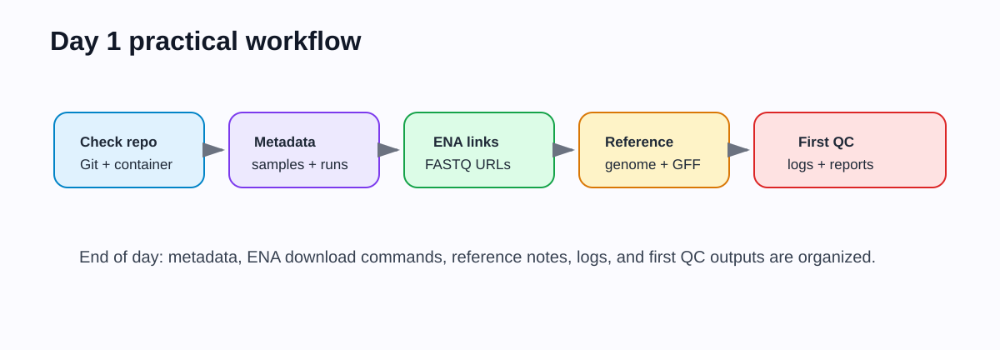
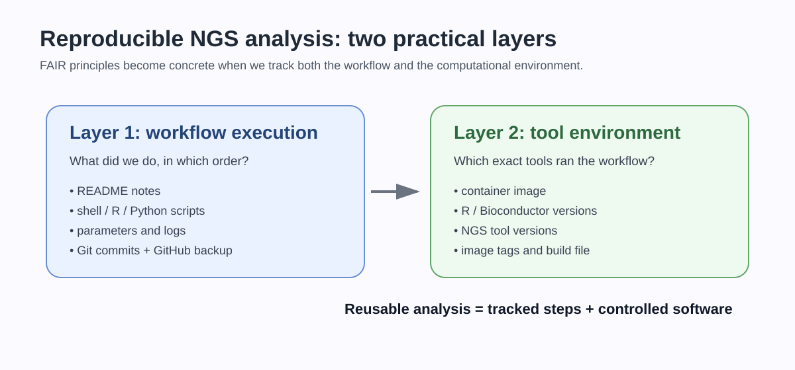
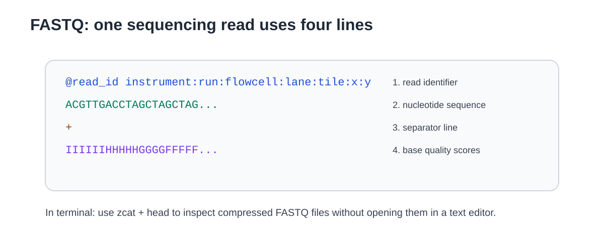

## Overview

Day 1 connects reproducible project structure with public sequencing resources. Students create the core metadata files, learn how public sequencing records are organized, retrieve or inspect FASTQ links, and prepare the reference genome and annotation used by RNA-seq and ChIP-seq workflows.

{#fig-day1-overview width="100%" fig-alt="Day 1 workflow from setup check to metadata, public data retrieval, reference genome, and first QC."}

The practical route for this workshop uses ENA direct FASTQ links for the selected small RNA-seq and ChIP-seq datasets. We will still explain how GEO and SRA identifiers relate to ENA records, but students will not use SRA Toolkit as the main download route. The logic is: **metadata first, data download second, analysis third**.

## Today's path: how your repository grows

```text
Day 0 repository
  -> code/day1/README.md
  -> code/day1/metadata/samples_rnaseq.tsv
  -> code/day1/metadata/samples_chipseq.tsv
  -> code/day1/get_ena_metadata.sh
  -> code/day1/download_fastqs_from_table.sh
  -> code/day1/reference/REFERENCE.md
  -> data/raw_fastq/ locally, if downloading
  -> first QC output and logs
  -> commit and push
```

## Learning outcomes

By the end of Day 1, students should be able to:

- organize a small NGS project with clear folders and `.gitignore` rules;
- distinguish public-data records such as study, sample, experiment, and run;
- create sample metadata tables that drive the analysis;
- retrieve public sequencing files using documented commands;
- explain the structure and quality information of FASTQ files;
- obtain or record the reference genome and annotation used for mapping and counting;
- commit scripts, metadata, and notes without committing large sequencing files.

## Time plan

| Time | Activity |
|---:|---|
| 00:00-00:25 | Setup check, repository status, and execution route |
| 00:25-01:00 | Reproducibility stack, folder structure, and `.gitignore` |
| 01:00-01:45 | Public repositories: GEO, SRA, ENA, ArrayExpress and metadata |
| 01:45-02:00 | Break |
| 02:00-02:45 | FASTQ files, accessions, and selected-run tables |
| 02:45-03:25 | Reference genome, annotation, and genome indexes |
| 03:25-03:50 | First lightweight QC or checkpoint inspection |
| 03:50-04:00 | Commit and push Day 1 material |

## Conceptual background

### Public sequencing resources

Public sequencing archives separate the biological study from the physical samples and sequencing runs. The terminology differs slightly across repositories, but the structure is usually hierarchical:

```text
study / project
  -> biological samples
      -> sequencing experiments or libraries
          -> sequencing runs
              -> FASTQ files
```

For reproducible analysis, the **run accession** is often the practical unit used to download FASTQ files, while the **sample metadata** defines the biological design. A sample table should therefore connect biological variables to technical accessions.

Common fields include:

| Field | Meaning |
|---|---|
| `sample_id` | Short name used in the workshop |
| `assay` | RNA-seq or ChIP-seq |
| `condition` | Biological condition or treatment |
| `replicate` | Biological replicate number |
| `factor` | ChIP target, for example a TF or RNAP-associated factor |
| `control` | Input or negative control, when relevant |
| `run_accession` | SRA/ENA run identifier |
| `layout` | Single-end or paired-end |
| `fastq_url` | Direct download link, when using ENA |

### From accessions to analysis design

The run accession tells us which FASTQ file to download. It does not, by itself, define the biological comparison. The statistical design comes from the metadata columns that describe condition, replicate, assay and control relationships.

For example, two technical FASTQ files may belong to the same biological sample, while two biological replicates should represent independent biological material. Treating technical runs as biological replicates would make the downstream statistics look stronger than the experiment really is. The sample table is therefore part of the analysis model, not just a download list.

### FAIR as a practical workflow

In this course, FAIR is not an abstract slogan. It becomes concrete through an evidence trail:

```text
metadata table -> script or command -> log -> output -> README interpretation -> Git commit
```

If a result cannot be traced back through this chain, it is difficult to check, debug or reuse.

{#fig-day1-fair-stack width="100%" fig-alt="FAIR reproducibility stack connecting metadata, commands, software environment, and outputs."}

### FASTQ structure and base qualities

A FASTQ record contains four lines:

```text
@read_identifier
ACGTACGTACGT...
+
IIIIIIIIIIII...
```

The sequence line stores base calls. The quality line stores one character per base. Each character encodes a Phred quality score:

$$
Q = -10 \log_{10}(P_{\mathrm{error}})
$$

where $P_{\mathrm{error}}$ is the estimated probability that the base call is wrong. Rearranging:

$$
P_{\mathrm{error}} = 10^{-Q/10}
$$

For example, $Q=30$ corresponds to an estimated error probability of $10^{-3}$, or approximately 1 error per 1000 bases.

{#fig-day1-fastq width="90%" fig-alt="FASTQ file structure with identifier, sequence, separator, and quality string."}

### What the tools are doing

| Tool or file type | Bioinformatics role | Main concept |
|---|---|---|
| GEO/SRA/ENA/ArrayExpress | Public archives | Recover data provenance and accession metadata |
| GEO identifiers | Study/sample records | Often describe the experiment and point to run accessions |
| ENA FASTQ links | Direct download | Avoids conversion by downloading submitted FASTQ files |
| `wget`/`curl` | File transfer | Makes download commands explicit and repeatable |
| FASTQ | Raw read data | Sequence plus per-base quality |
| FASTA | Reference sequence | Genome or transcript sequences without annotation |
| GFF/GTF | Annotation | Genomic coordinates of genes, CDS, transcripts or other features |
| Bowtie2/BWA index | Search data structure | Allows fast alignment of reads to a genome |

Genome indexing is a computational shortcut. Rather than comparing every read to every genome position naively, aligners build an index that lets them find candidate mapping positions quickly. Different aligners use different indexing strategies, but the teaching point is the same: **the reference genome must be indexed before efficient mapping is possible**.

### Reference genome and annotation consistency

RNA-seq and ChIP-seq integration requires the same coordinate system throughout the project. The genome FASTA, annotation file, BAM files, bigWig tracks, and peak files must agree on chromosome or contig names and coordinate conventions.

For example, these names must not be mixed without conversion:

```text
NC_000915.1
chr1
chromosome
H_pylori_26695
```

Coordinate consistency is more important than tool choice. If the annotation refers to one contig name and the BAM files use another, counting and peak annotation can silently fail or produce empty overlaps.

## 1. Check your repository

Open your student repository in VS Code and run:

```bash
git status
pwd
ls
```

You should see the files created on Day 0.

Create the Day 1 folders:

```bash
mkdir -p code/day1
mkdir -p code/day1/metadata
mkdir -p code/day1/reference
mkdir -p data/genome
mkdir -p data/raw_fastq/rnaseq
mkdir -p data/raw_fastq/chipseq
mkdir -p results/logs/day1
mkdir -p results/day1/qc
```

Open `README.md` in VS Code and add:

```markdown
## Day 1 objective

Day 1 documents public data accessions, sample metadata, reference genome files, and the first QC step.
```

## 2. Confirm what will be versioned

Open `.gitignore` in VS Code and add these rules if they are not already present:

```gitignore
# Raw and intermediate NGS data
data/raw_fastq/
data/trimmed_fastq/
data/bam/
*.fastq
*.fq
*.fastq.gz
*.fq.gz
*.sra
*.sam
*.bam
*.bai
*.bw
*.bigWig

# Generated temporary files
results/tmp/
*.tmp
```

Commit metadata and scripts, not raw FASTQ/BAM/bigWig files.

## 3. Create a study metadata note

Create `code/day1/README.md` in VS Code and paste:

```markdown
# Day 1 - public data and project setup

This folder contains notes, accession tables and scripts used to retrieve or inspect public sequencing data.

## Dataset

- Organism: to be defined by instructor
- RNA-seq design: to be defined by instructor
- ChIP-seq design: to be defined by instructor
- Reference genome: to be defined by instructor
- Annotation source: to be defined by instructor

## Execution route

- Local Docker/Podman / university workstation / checkpoint route: to be recorded
```

## 4. Create sample metadata tables

Create `code/day1/metadata/samples_rnaseq.tsv` in VS Code and paste:

```text
sample_id	assay	condition	replicate	run_accession	layout	fastq_url
WT_RNA_1	RNAseq	WT	1	RUN_TO_DEFINE	SE	URL_TO_DEFINE
WT_RNA_2	RNAseq	WT	2	RUN_TO_DEFINE	SE	URL_TO_DEFINE
KO_RNA_1	RNAseq	KO	1	RUN_TO_DEFINE	SE	URL_TO_DEFINE
KO_RNA_2	RNAseq	KO	2	RUN_TO_DEFINE	SE	URL_TO_DEFINE
```

Create `code/day1/metadata/samples_chipseq.tsv` in VS Code and paste:

```text
sample_id	assay	factor	condition	replicate	is_control	control_sample	run_accession	layout	fastq_url
TF_IP_1	ChIPseq	TF	condition_A	1	no	Input_1	RUN_TO_DEFINE	SE	URL_TO_DEFINE
TF_IP_2	ChIPseq	TF	condition_A	2	no	Input_1	RUN_TO_DEFINE	SE	URL_TO_DEFINE
Input_1	ChIPseq	Input	condition_A	1	yes	NA	RUN_TO_DEFINE	SE	URL_TO_DEFINE
```

The exact rows will be edited after the instructor presents the selected dataset.

## 5. Retrieve metadata from ENA

### ENA direct FASTQ route

ENA metadata can be queried to obtain run tables and direct FASTQ URLs. For the workshop teaching datasets, use ENA/ArrayExpress accessions:

```text
RNA-seq:  E-MTAB-13025
ChIP-seq: E-MTAB-13026
```

Create `code/day1/get_ena_metadata.sh` in VS Code and paste:

```bash
#!/usr/bin/env bash
set -euo pipefail

OUTDIR="code/day1/metadata"
mkdir -p "${OUTDIR}"

FIELDS="run_accession,sample_accession,experiment_accession,library_layout,fastq_ftp,submitted_ftp,read_count,base_count"

for accession in E-MTAB-13025 E-MTAB-13026; do
  curl -L \
    "https://www.ebi.ac.uk/ena/portal/api/filereport?accession=${accession}&result=read_run&fields=${FIELDS}&format=tsv" \
    -o "${OUTDIR}/${accession}_ena_runs.tsv"
done
```

Make the script executable and run it:

```bash
chmod +x code/day1/get_ena_metadata.sh
bash code/day1/get_ena_metadata.sh 2>&1 | tee results/logs/day1/01_get_ena_metadata.log
```

::: {.callout-note}
## GEO/SRA context

Many papers and GEO records describe datasets through GEO or SRA identifiers. We use those identifiers to understand provenance, but the practical download table for this workshop comes from ENA because it provides direct FASTQ links.
:::

## 6. Download selected FASTQ files

Create `code/day1/download_fastqs_from_table.sh` in VS Code and paste:

```bash
#!/usr/bin/env bash
set -euo pipefail

TABLE=${1:?"Usage: bash download_fastqs_from_table.sh metadata.tsv output_dir"}
OUTDIR=${2:?"Usage: bash download_fastqs_from_table.sh metadata.tsv output_dir"}
mkdir -p "${OUTDIR}" results/logs/day1

# Required columns: sample_id, run_accession, layout, fastq_url.
# For paired-end data, fastq_url values may contain two URLs separated by semicolons.
printf "sample_id\trun_accession\tfastq_url\n" > results/logs/day1/download_manifest.tsv

awk -F'\t' '
NR == 1 {
  for (i = 1; i <= NF; i++) col[$i] = i
  split("sample_id run_accession layout fastq_url", req, " ")
  for (i in req) {
    if (!(req[i] in col)) {
      print "Missing required column: " req[i] > "/dev/stderr"
      exit 1
    }
  }
  next
}
{
  print $(col["sample_id"]) "\t" $(col["run_accession"]) "\t" $(col["layout"]) "\t" $(col["fastq_url"])
}
' "${TABLE}" | while IFS=$'\t' read -r sample_id run_accession layout fastq_url; do
  if [[ -z "${fastq_url}" || "${fastq_url}" == "NA" || "${fastq_url}" == "URL_TO_DEFINE" ]]; then
    echo "Skipping ${sample_id}: fastq_url is not defined"
    continue
  fi
  echo "Downloading ${sample_id} from ${fastq_url}"
  echo "${sample_id}\t${run_accession}\t${fastq_url}" >> results/logs/day1/download_manifest.tsv
  IFS=';' read -ra URLS <<< "${fastq_url}"
  i=1
  for url in "${URLS[@]}"; do
    clean_url="https://${url#ftp://}"
    if [[ "${layout}" == "PAIRED" || "${layout}" == "PE" ]]; then
      outfile="${OUTDIR}/${sample_id}_R${i}.fastq.gz"
    else
      outfile="${OUTDIR}/${sample_id}.fastq.gz"
    fi
    curl -L "${clean_url}" -o "${outfile}"
    i=$((i+1))
  done
done
```

Make it executable:

```bash
chmod +x code/day1/download_fastqs_from_table.sh
```

Use only after the instructor confirms the selected subset:

```bash
bash code/day1/download_fastqs_from_table.sh \
  code/day1/metadata/samples_rnaseq.tsv \
  data/raw_fastq/rnaseq
```

## 7. Inspect FASTQ files

List files:

```bash
ls -lh data/raw_fastq/rnaseq
```

Inspect the first record without decompressing to disk:

```bash
zcat data/raw_fastq/rnaseq/WT_RNA_1.fastq.gz | head -n 4
```

Count lines and estimate reads:

```bash
zcat data/raw_fastq/rnaseq/WT_RNA_1.fastq.gz | wc -l
```

Number of reads is approximately:

$$
N_{\mathrm{reads}} = \frac{N_{\mathrm{lines}}}{4}
$$

## 8. Reference genome and annotation

Create `code/day1/reference/REFERENCE.md` in VS Code and paste:

```markdown
# Reference genome and annotation

- Organism: to be defined
- Genome FASTA source: to be defined
- Annotation source: to be defined
- Genome accession/version: to be defined
- Annotation version/date: to be defined
- Contig naming checked: yes/no
```

When files are provided or downloaded, keep them under:

```text
data/genome/genome.fa
data/genome/annotation.gff3
```

Do not rename contigs manually unless the conversion is documented.

## 9. Optional first QC

If the selected FASTQ files are available, run a lightweight QC tool such as FastQC, Falco, or another course-provided command. The purpose is not yet to interpret every plot, but to confirm that the files are readable and that the first analysis output can be generated.

Example placeholder:

```bash
mkdir -p results/day1/qc
fastqc data/raw_fastq/rnaseq/WT_RNA_1.fastq.gz -o results/day1/qc
```

## 10. End-of-day commit

Add only small text files, scripts, and metadata:

```bash
git status
git add README.md .gitignore code/day1
git commit -m "Add Day 1 metadata and public data retrieval notes"
git push
```

Do not add FASTQ files.

## Self-check questions

1. Which column in your sample table links a biological sample to a public sequencing run?
2. Why is the reference genome version part of the analysis record?
3. What information is lost if FASTQ files are downloaded manually without recording URLs or accessions?
4. Why should FASTQ, BAM, and bigWig files usually be excluded from Git?
5. What is the difference between a FASTA genome file and a GFF/GTF annotation file?

## Day 1 checkpoint

By the end of Day 1, your repository should contain:

```text
code/day1/README.md
code/day1/metadata/samples_rnaseq.tsv
code/day1/metadata/samples_chipseq.tsv
code/day1/get_ena_metadata.sh
code/day1/download_fastqs_from_table.sh
code/day1/reference/REFERENCE.md
README.md
.gitignore
```

Your repository should also state which execution route you will attempt on Day 2.

## How to report issues

If you have a GitHub account, report Day 1 problems by opening an **Issue** in your student repository.

Include:

- `Day 1` and the step number in the issue title;
- your operating system;
- the command you ran;
- the exact error message;
- the relevant log file, for example `results/logs/day1/01_get_ena_metadata.log`.

If you cannot create or access a GitHub account, email:

```text
francesco.gualdrini@gmail.com
```

Use email only for GitHub account/access problems. Use GitHub Issues for workshop technical questions whenever possible.
