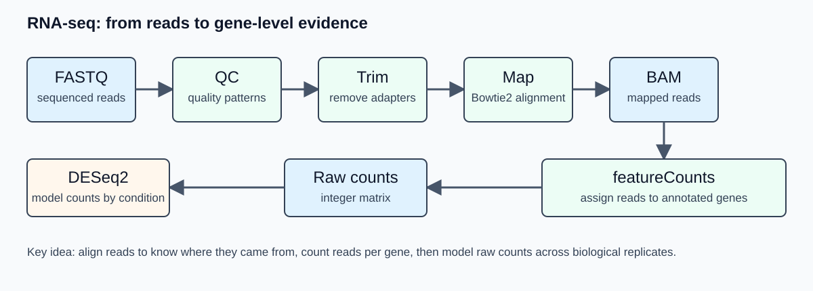

## Overview

Day 2 follows a bulk RNA-seq workflow on a small genome. The practical path is:

```text
FASTQ -> QC -> trimming -> mapping -> BAM -> featureCounts -> raw count matrix -> DESeq2
```

Genome-browser tracks are generated from BAM files for visual inspection, but differential expression is performed from **raw integer gene counts**, not from bigWig signal.

{#fig-day2-rnaseq-flow width="100%" fig-alt="RNA-seq workflow from FASTQ reads through QC, trimming, mapping, gene counting, normalized tracks, and DESeq2."}

## Today's path: how your repository grows

```text
data/raw_fastq/rnaseq/ or RNA-seq checkpoints
  -> code/day2_rnaseq/README.md
  -> results/rnaseq/qc/
  -> data/trimmed_fastq/rnaseq/
  -> data/bam/rnaseq/
  -> data/raw_counts/rnaseq/
  -> results/rnaseq/deseq2/
  -> results/rnaseq/plots/
  -> results/logs/day2/
  -> commit and push
```

## Learning outcomes

By the end of Day 2, students should be able to:

- explain the role of QC, trimming, mapping, counting, normalization, and differential testing;
- distinguish raw counts, normalized counts, and genome-browser coverage tracks;
- describe how reads are assigned to annotated genes;
- understand why biological replicates are required for differential expression;
- run selected RNA-seq commands or continue from checkpoint count matrices;
- interpret PCA, MA plots, volcano plots, and DESeq2 result columns.

## Time plan

| Time | Activity |
|---:|---|
| 00:00-00:25 | Experimental design and count-based RNA-seq logic |
| 00:25-01:05 | FASTQ QC and trimming concepts |
| 01:05-01:50 | Mapping and BAM files |
| 01:50-02:05 | Break |
| 02:05-02:45 | Gene counting with annotation |
| 02:45-03:35 | DESeq2 model, normalization, PCA, MA plot |
| 03:35-03:50 | bigWig tracks and visual inspection |
| 03:50-04:00 | Commit and push Day 2 material |

## Conceptual background

### RNA-seq measurement model

Bulk RNA-seq does not measure absolute RNA concentration directly. It samples sequencing reads from a pool of cDNA fragments. After mapping and gene assignment, the basic data object is a matrix:

$$
K = \{k_{ij}\}
$$

where $k_{ij}$ is the number of reads assigned to gene $i$ in sample $j$.

For differential expression, the important comparison is not whether one sample has more reads overall. The important question is whether a gene changes **relative to the library composition and biological variability** across conditions.

A simplified count model is:

$$
k_{ij} \sim \mathrm{NB}(\mu_{ij}, \alpha_i)
$$

where $\mu_{ij}$ is the expected count for gene $i$ in sample $j$, and $\alpha_i$ is a gene-specific dispersion parameter. The negative binomial distribution is used because RNA-seq count variability is usually larger than expected under a simple Poisson model.

### Replicates and dispersion

Biological replicates are what allow the model to estimate biological variability. In DESeq2, the dispersion parameter captures gene-specific variability beyond simple sampling noise. With no biological replication, this variability cannot be estimated from the experiment; with only two replicates per condition, inference is possible but fragile.

For the workshop, a small design is acceptable because the goal is to learn the workflow. In real experiments, additional biological replicates usually improve dispersion estimation, outlier detection and confidence in effect sizes.

### Library-size normalization

If sample $j$ has a larger sequencing library, many genes may have larger raw counts even without biological change. DESeq2 estimates sample-specific size factors $s_j$ and models normalized abundance approximately as:

$$
q_{ij} = \frac{k_{ij}}{s_j}
$$

The size factor is not just the total number of reads; it is estimated robustly from the relative behavior of many genes. This reduces the influence of a small number of highly abundant or strongly changing genes.

### Log fold change and statistical testing

A common summary is the log2 fold change:

$$
\log_2 FC_i = \log_2\left(\frac{\mathrm{mean\ normalized\ count}_{i,\ condition\ B}}{\mathrm{mean\ normalized\ count}_{i,\ condition\ A}}\right)
$$

DESeq2 estimates log fold changes within a generalized linear model and tests whether the condition effect is different from zero. Because thousands of genes are tested, p-values are corrected for multiple testing. The adjusted p-value controls the expected false discovery rate among the genes called significant.

### Why raw counts are used for DESeq2

DESeq2 expects raw integer counts because its model estimates size factors and dispersion from the count distribution. Pre-normalized values such as TPM, CPM, RPKM, or bigWig signal should not be used as input to DESeq2.

### What the tools are doing

| Step | Tool examples | Main output | Bioinformatics concept |
|---|---|---|---|
| FASTQ QC | FastQC, Falco, MultiQC | QC reports | Base quality, adapter content, composition biases |
| Trimming | fastp, cutadapt | trimmed FASTQ | Remove adapters/low-quality tails when justified |
| Mapping | bowtie2, bwa | SAM/BAM | Place reads on the reference genome |
| BAM processing | samtools | sorted BAM + BAI | Coordinate-sorted alignments for downstream tools |
| Counting | featureCounts | raw count table | Assign mapped reads to annotated genes |
| Track generation | deepTools `bamCoverage` | bigWig | Normalized coverage for visualization |
| Differential expression | DESeq2 | result table, plots | Count model, normalization, dispersion, testing |

FASTQ structure and base-quality encoding were introduced on Day 1. Today we use those files as inputs to a count-based RNA-seq workflow.

### Mapping and ambiguity

A read can map uniquely, map to multiple positions, or fail to map. In small bacterial genomes, mapping is usually faster and less ambiguous than in large mammalian genomes, but ambiguity still exists in repeated regions, paralogous genes, rRNA sequences, and low-complexity regions.

Important mapping statistics include:

- total reads;
- percentage mapped;
- percentage uniquely mapped, if reported;
- number of reads discarded or unassigned;
- strand-specificity, if relevant.

### Counting with genomic features

featureCounts compares read alignments with annotation intervals. For a simple bacterial gene annotation, a read is counted for a gene if its genomic alignment overlaps the gene feature according to the selected parameters. Strand-specific libraries require strand-aware counting; otherwise, reads may be assigned to the wrong overlapping feature.

The count matrix should have genes as rows and samples as columns:

```text
gene_id  WT_1  WT_2  KO_1  KO_2
geneA     120   134    62    58
geneB       5     8     6     7
```

### Genome-browser tracks

A bigWig file stores continuous coverage signal across the genome. For RNA-seq, CPM-normalized coverage is often useful for visual inspection:

$$
\mathrm{CPM}_{b} = \frac{\mathrm{reads\ in\ bin\ } b}{\mathrm{total\ mapped\ reads}} \times 10^6
$$

bigWigs are useful for inspecting expression patterns, operons, strandedness, and suspicious regions. They are not a substitute for gene-level statistical testing.

## 1. Prepare Day 2 folders

From the root of your repository:

```bash
mkdir -p code/day2_rnaseq
mkdir -p data/trimmed_fastq/rnaseq
mkdir -p data/bam/rnaseq
mkdir -p data/raw_counts/rnaseq
mkdir -p results/rnaseq/qc
mkdir -p results/rnaseq/bigwig
mkdir -p results/rnaseq/deseq2
mkdir -p results/rnaseq/plots
mkdir -p results/logs/day2
```

Create `code/day2_rnaseq/README.md` in VS Code and paste:

```markdown
# Day 2 - RNA-seq

This folder documents the RNA-seq workflow used in the workshop.

Execution route:
- Full local execution / partial local execution / checkpoint route: to be recorded

Main inputs:
- sample metadata: code/day1/metadata/samples_rnaseq.tsv
- genome: data/genome/genome.fa
- annotation: data/genome/annotation.gff3
```

## 2. FASTQ QC

Example command:

```bash
fastqc data/raw_fastq/rnaseq/WT_RNA_1.fastq.gz \
  -o results/rnaseq/qc
```

Multi-sample command:

```bash
fastqc data/raw_fastq/rnaseq/*.fastq.gz \
  -o results/rnaseq/qc \
  2>&1 | tee results/logs/day2/01_fastqc_raw.log
```

Summarize if MultiQC is available:

```bash
multiqc results/rnaseq/qc \
  -o results/rnaseq/qc \
  2>&1 | tee results/logs/day2/02_multiqc_raw.log
```

## 3. Trimming

Example using `fastp`:

```bash
fastp \
  -i data/raw_fastq/rnaseq/WT_RNA_1.fastq.gz \
  -o data/trimmed_fastq/rnaseq/WT_RNA_1.trimmed.fastq.gz \
  --thread 2 \
  --html results/rnaseq/qc/WT_RNA_1.fastp.html \
  --json results/rnaseq/qc/WT_RNA_1.fastp.json \
  2>&1 | tee results/logs/day2/03_trim_fastp_WT_RNA_1.log
```

Trimming should be interpreted from QC evidence. Removing too much sequence can shorten reads unnecessarily and reduce mapping quality.

## 4. Mapping to the reference genome

Build an index once:

```bash
bowtie2-build data/genome/genome.fa data/genome/genome_index
```

Map one single-end sample:

```bash
bowtie2 \
  -x data/genome/genome_index \
  -U data/trimmed_fastq/rnaseq/WT_RNA_1.trimmed.fastq.gz \
  -p 2 \
  2> results/logs/day2/04_bowtie2_WT_RNA_1.log \
| samtools sort -@ 2 -o data/bam/rnaseq/WT_RNA_1.sorted.bam

samtools index data/bam/rnaseq/WT_RNA_1.sorted.bam
```

Inspect:

```bash
samtools flagstat data/bam/rnaseq/WT_RNA_1.sorted.bam \
  > results/logs/day2/05_flagstat_WT_RNA_1.txt
```

## 5. Gene counting

Run featureCounts on one or more BAM files:

```bash
featureCounts \
  -a data/genome/annotation.gff3 \
  -o data/raw_counts/rnaseq/gene_counts.txt \
  data/bam/rnaseq/*.sorted.bam \
  2>&1 | tee results/logs/day2/06_featurecounts.log
```

Check the summary:

```bash
cat data/raw_counts/rnaseq/gene_counts.txt.summary
```

Keep the unnormalized count matrix for DESeq2.

## 6. Generate RNA-seq bigWig tracks

```bash
bamCoverage \
  -b data/bam/rnaseq/WT_RNA_1.sorted.bam \
  -o results/rnaseq/bigwig/WT_RNA_1.CPM.bw \
  --normalizeUsing CPM \
  --binSize 10 \
  --numberOfProcessors 2 \
  2>&1 | tee results/logs/day2/07_bamcoverage_WT_RNA_1.log
```

The bigWig is useful for visualization in IGV or a genome browser. It is not the input for DESeq2.

## 7. DESeq2 from raw counts

Use a count matrix and sample metadata. The instructor may provide a ready checkpoint matrix if mapping/counting cannot be completed locally.

Minimal R skeleton:

```r
library(DESeq2)

counts <- read.delim("data/raw_counts/rnaseq/gene_count_matrix.tsv", row.names = 1)
coldata <- read.delim("code/day1/metadata/samples_rnaseq.tsv")

# Make sure sample order matches count columns.
coldata <- coldata[match(colnames(counts), coldata$sample_id), ]
stopifnot(all(colnames(counts) == coldata$sample_id))

dds <- DESeqDataSetFromMatrix(
  countData = counts,
  colData = coldata,
  design = ~ condition
)

dds <- dds[rowSums(counts(dds)) >= 10, ]
dds <- DESeq(dds)
res <- results(dds, contrast = c("condition", "KO", "WT"))
res <- as.data.frame(res)
res$gene_id <- rownames(res)

write.table(res, "results/rnaseq/deseq2/deseq2_results.tsv",
            sep = "\t", quote = FALSE, row.names = FALSE)
```

Common result columns:

| Column | Meaning |
|---|---|
| `baseMean` | Mean normalized count across samples |
| `log2FoldChange` | Estimated condition effect on log2 scale |
| `lfcSE` | Standard error of log2 fold change |
| `stat` | Test statistic |
| `pvalue` | Raw p-value |
| `padj` | Multiple-testing adjusted p-value |

## 8. PCA and MA plot interpretation

A PCA plot summarizes the largest sources of variation after transformation of the count matrix. Replicates should usually cluster more closely to each other than to samples from a different condition. If they do not, first check metadata, sample naming, batch effects, and QC logs.

An MA plot displays:

$$
M_i = \log_2 FC_i
$$

against an average abundance measure. It helps identify whether large fold changes are concentrated among low-count genes and whether the distribution is centered as expected.

## 9. Checkpoint route

If FASTQ-to-BAM processing is too slow or fails, continue from:

```text
checkpoints/rnaseq/gene_count_matrix.tsv
checkpoints/rnaseq/sample_metadata.tsv
checkpoints/rnaseq/multiqc_report.html
checkpoints/rnaseq/bigwig/*.bw
```

Record the route in `code/day2_rnaseq/README.md`:

```text
Mapping and counting were demonstrated in class. This analysis used the provided count-matrix checkpoint for DESeq2 because local FASTQ-to-BAM execution was not feasible on this laptop.
```

## 10. Commit Day 2 material

Do not commit BAM or bigWig files unless the instructor explicitly asks for tiny examples.

```bash
git status
git add code/day2_rnaseq results/rnaseq/qc results/rnaseq/deseq2 results/rnaseq/plots results/logs/day2 README.md
git commit -m "Add RNA-seq analysis notes and DESeq2 results"
git push
```

## Expected outputs

By the end of Day 2, you should have some combination of:

```text
results/rnaseq/qc/multiqc_report.html
results/logs/day2/*.log
data/raw_counts/rnaseq/gene_counts.txt
results/rnaseq/deseq2/deseq2_results.tsv
results/rnaseq/plots/pca_plot.png
results/rnaseq/plots/ma_plot.png
results/rnaseq/plots/volcano_plot.png
```

## Self-check questions

1. Why does DESeq2 require raw integer counts rather than CPM or bigWig signal?
2. What biological information is represented by a row in the count matrix?
3. What can cause low mapping percentage in RNA-seq?
4. Why is an adjusted p-value used instead of only a raw p-value?
5. What is the difference between a gene count table and a genome-browser track?

## How to report issues

If you have a GitHub account, report Day 2 problems by opening an **Issue** in your student repository.

Include:

- `Day 2` and the step number in the issue title;
- your operating system;
- whether you used full local execution or checkpoint mode;
- the command you ran;
- the exact error message;
- the relevant log file, for example `results/logs/day2/04_bowtie2_WT_RNA_1.log`.

If you cannot create or access a GitHub account, email:

```text
francesco.gualdrini@gmail.com
```

Use email only for GitHub account/access problems. Use GitHub Issues for workshop technical questions whenever possible.
