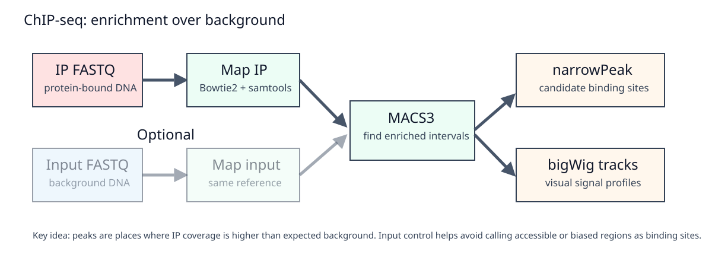

## Overview

Day 3 follows a transcription-factor ChIP-seq workflow on a small genome. The practical path is:

```text
FASTQ -> QC -> trimming -> mapping -> BAM -> peak calling -> peak files -> tracks -> motif input
```

The central comparison is peak calling **with input control** versus peak calling **without input control**.

{#fig-day3-chipseq-flow width="100%" fig-alt="ChIP-seq workflow showing IP and input reads mapped to the genome, peak calling, tracks, and motif discovery."}

## Today's path: how your repository grows

```text
data/raw_fastq/chipseq/ or ChIP-seq checkpoints
  -> code/day3_chipseq/README.md
  -> results/chipseq/qc/
  -> data/trimmed_fastq/chipseq/
  -> data/bam/chipseq/
  -> results/chipseq/bigwig/
  -> results/chipseq/peaks/
  -> results/chipseq/motifs/
  -> results/logs/day3/
  -> commit and push
```

## Learning outcomes

By the end of Day 3, students should be able to:

- explain IP, input, background, enrichment, peaks, and summits;
- distinguish BAM alignments, bigWig signal tracks, BED/narrowPeak intervals, and motif FASTA files;
- describe why input controls change peak calling;
- run or interpret MACS3 peak calling with and without input;
- generate or interpret IP and IP/input bigWig tracks;
- extract peak sequences and interpret basic motif discovery output;
- document checkpoint use when local compute is not feasible.

## Time plan

| Time | Activity |
|---:|---|
| 00:00-00:30 | ChIP-seq design, IP/input controls, and peak concepts |
| 00:30-01:10 | QC, trimming, and mapping |
| 01:10-01:50 | BAM processing and signal tracks |
| 01:50-02:05 | Break |
| 02:05-02:50 | MACS3 peak calling with and without input |
| 02:50-03:30 | Peak files, summits, and motif input |
| 03:30-03:50 | Motif discovery and interpretation |
| 03:50-04:00 | Commit and push Day 3 material |

## Conceptual background

### What ChIP-seq measures

ChIP-seq enriches DNA fragments associated with a protein or histone modification. After sequencing and mapping, regions with an excess of IP reads relative to background are called peaks.

For a transcription factor, a true binding event often appears as a localized enrichment. The peak interval represents the enriched region, while the summit approximates the position of maximum signal.

The basic statistical contrast is:

$$
\mathrm{enrichment}(x) = \frac{\mathrm{IP\ signal}(x)}{\mathrm{background\ signal}(x)}
$$

where $x$ is a genomic position or window. In practice, tools estimate background from local and genome-wide read distributions rather than using this simple ratio directly.

### TF peaks versus histone marks

This workshop treats ChIP-seq as a transcription-factor or regulatory-protein experiment with relatively narrow enrichment regions. Histone marks can produce broad domains, diffuse signal or very different background structure. The same QC ideas still matter, but peak-calling parameters and biological interpretation would need to change for broad histone marks.

### Why input control matters

Input DNA represents sequenced chromatin or fragmented DNA before immunoprecipitation. It captures non-specific effects such as:

- local mappability differences;
- copy-number or amplification biases;
- fragmentation biases;
- highly accessible or repetitive regions;
- sequencing-depth differences.

Calling peaks without input may be useful for demonstration, but it can overcall regions that are enriched for technical reasons. Comparing peak calls with and without input is a good way to see what the control contributes.

### MACS3 peak-calling intuition

MACS3 scans the genome for IP read pileups that are stronger than expected under a background model. With input DNA, the background can be estimated from control coverage and local genomic context. Without input, MACS3 must infer background from the IP data itself, which is less reliable in regions with unusual mappability or accessibility.

The output peak interval is a statistical call after thresholding. The summit is the local maximum inside the enriched region. Neither object should be interpreted without checking the control, the genome size parameter, read depth and biological design.

### Fragment model and strand shift

In TF ChIP-seq, forward-strand reads tend to pile up on one side of a binding site and reverse-strand reads on the other. The distance between these strand-specific modes approximates the fragment length. Peak callers use this information, or a related model, to position enrichment more accurately around binding events.

A simplified representation is:

$$
\Delta = \operatorname*{arg\,max}_{d}\; \mathrm{corr}(F(x), R(x+d))
$$

where $F(x)$ and $R(x)$ are forward- and reverse-strand read densities, and $d$ is the strand shift that maximizes their correlation.

For this workshop, the main teaching point is conceptual: TF ChIP-seq signal is not just read depth; the orientation and distribution of reads around binding sites contain information.

### Peak files and genome-browser tracks

A peak file stores intervals. A bigWig stores continuous signal. They answer different questions:

| File | Question answered |
|---|---|
| BAM | Where did each read align? |
| BAI | How can software access BAM regions efficiently? |
| bigWig | What is the genome-wide coverage or enrichment signal? |
| BED/narrowPeak | Which genomic intervals were called as peaks? |
| summits BED | Where is the strongest point inside each peak? |
| FASTA from peaks | Which DNA sequences are used for motif discovery? |

### What the tools are doing

| Step | Tool examples | Main output | Bioinformatics concept |
|---|---|---|---|
| FASTQ QC | FastQC, Falco, MultiQC | QC reports | Base quality, adapters, composition biases |
| Trimming | fastp, cutadapt | trimmed FASTQ | Remove adapters and poor-quality tails when needed |
| Mapping | bowtie2, bwa | sorted BAM | Place ChIP and input reads on the reference genome |
| BAM QC | samtools | flagstat/logs | Check mapping rate and usable reads |
| Track generation | deepTools `bamCoverage`, `bamCompare` | bigWig | Coverage or log2 IP/input signal |
| Peak calling | MACS3 | BED/narrowPeak/summits | Statistical enrichment of IP over background |
| Sequence extraction | bedtools getfasta | FASTA | Peak-associated DNA sequences |
| Motif discovery | MEME-STREME | motif report | Overrepresented sequence patterns |

FASTQ structure and base-quality encoding were introduced on Day 1. Today we focus on how mapped ChIP-seq reads become enrichment tracks and peak intervals.

### Motif discovery intuition

A transcription factor often binds related DNA words rather than a single exact sequence. A motif model describes the probability of each base at each position:

$$
P(s_1,\ldots,s_L) = \prod_{\ell=1}^{L} P_{\ell}(s_{\ell})
$$

where $P_{\ell}(s_{\ell})$ is the probability of observing base $s$ at motif position $\ell$. Motif discovery asks whether some sequence pattern appears more often in peak sequences than expected from a background model.

Motif enrichment supports biological interpretation, but it does not prove direct binding alone. It should be interpreted together with ChIP signal, peak quality, gene proximity, and RNA-seq results.

## 1. Prepare Day 3 folders

```bash
mkdir -p code/day3_chipseq
mkdir -p data/trimmed_fastq/chipseq
mkdir -p data/bam/chipseq
mkdir -p results/chipseq/qc
mkdir -p results/chipseq/bigwig
mkdir -p results/chipseq/peaks/no_input
mkdir -p results/chipseq/peaks/with_input
mkdir -p results/chipseq/motifs
mkdir -p results/logs/day3
```

Create `code/day3_chipseq/README.md` in VS Code and paste:

```markdown
# Day 3 - ChIP-seq

This folder documents the ChIP-seq workflow.

Execution route:
- Full local execution / partial local execution / checkpoint route: to be recorded

Main inputs:
- sample metadata: code/day1/metadata/samples_chipseq.tsv
- genome: data/genome/genome.fa
- ChIP FASTQ or checkpoint files
```

## 2. FASTQ QC and trimming

Run QC on available ChIP-seq FASTQ files:

```bash
fastqc data/raw_fastq/chipseq/*.fastq.gz \
  -o results/chipseq/qc \
  2>&1 | tee results/logs/day3/01_fastqc_raw.log
```

Trim one IP sample:

```bash
fastp \
  -i data/raw_fastq/chipseq/TF_IP_1.fastq.gz \
  -o data/trimmed_fastq/chipseq/TF_IP_1.trimmed.fastq.gz \
  --thread 2 \
  --html results/chipseq/qc/TF_IP_1.fastp.html \
  --json results/chipseq/qc/TF_IP_1.fastp.json \
  2>&1 | tee results/logs/day3/02_trim_fastp_TF_IP_1.log
```

Repeat for the input sample or use the course scripts/checkpoints.

## 3. Mapping and BAM processing

Build the index if it was not already built:

```bash
bowtie2-build data/genome/genome.fa data/genome/genome_index
```

Map IP:

```bash
bowtie2 \
  -x data/genome/genome_index \
  -U data/trimmed_fastq/chipseq/TF_IP_1.trimmed.fastq.gz \
  -p 2 \
  2> results/logs/day3/03_bowtie2_TF_IP_1.log \
| samtools sort -@ 2 -o data/bam/chipseq/TF_IP_1.sorted.bam

samtools index data/bam/chipseq/TF_IP_1.sorted.bam
```

Map input similarly:

```bash
bowtie2 \
  -x data/genome/genome_index \
  -U data/trimmed_fastq/chipseq/Input_1.trimmed.fastq.gz \
  -p 2 \
  2> results/logs/day3/04_bowtie2_Input_1.log \
| samtools sort -@ 2 -o data/bam/chipseq/Input_1.sorted.bam

samtools index data/bam/chipseq/Input_1.sorted.bam
```

Inspect mapping summaries:

```bash
samtools flagstat data/bam/chipseq/TF_IP_1.sorted.bam \
  > results/logs/day3/05_flagstat_TF_IP_1.txt
```

## 4. Generate ChIP-seq bigWig tracks

IP coverage track:

```bash
bamCoverage \
  -b data/bam/chipseq/TF_IP_1.sorted.bam \
  -o results/chipseq/bigwig/TF_IP_1.CPM.bw \
  --normalizeUsing CPM \
  --binSize 10 \
  --numberOfProcessors 2 \
  2>&1 | tee results/logs/day3/06_bamcoverage_TF_IP_1.log
```

Input-normalized log2 track:

```bash
bamCompare \
  -b1 data/bam/chipseq/TF_IP_1.sorted.bam \
  -b2 data/bam/chipseq/Input_1.sorted.bam \
  --operation log2 \
  --normalizeUsing CPM \
  --binSize 10 \
  --numberOfProcessors 2 \
  -o results/chipseq/bigwig/TF_IP_1.log2_IP_vs_input.bw \
  2>&1 | tee results/logs/day3/07_bamcompare_TF_IP_1.log
```

The log2 IP/input signal is:

$$
\log_2\left(\frac{\mathrm{IP\ signal} + c}{\mathrm{Input\ signal} + c}\right)
$$

where $c$ is a small pseudocount used to avoid division by zero.

## 5. Peak calling without input

```bash
macs3 callpeak \
  -t data/bam/chipseq/TF_IP_1.sorted.bam \
  -f BAM \
  -g 1.7e6 \
  -n TF_IP_1_no_input \
  --outdir results/chipseq/peaks/no_input \
  2>&1 | tee results/logs/day3/08_macs3_no_input.log
```

This demonstrates the behavior of peak calling when no explicit background sample is provided.

## 6. Peak calling with input

```bash
macs3 callpeak \
  -t data/bam/chipseq/TF_IP_1.sorted.bam \
  -c data/bam/chipseq/Input_1.sorted.bam \
  -f BAM \
  -g 1.7e6 \
  -n TF_IP_1_with_input \
  --outdir results/chipseq/peaks/with_input \
  2>&1 | tee results/logs/day3/09_macs3_with_input.log
```

Replace `1.7e6` with the approximate mappable genome size for the selected organism. For a bacterial teaching dataset, this value is usually close to the genome size in base pairs.

## 7. Compare peak calls

Count peaks:

```bash
wc -l results/chipseq/peaks/no_input/*_peaks.narrowPeak
wc -l results/chipseq/peaks/with_input/*_peaks.narrowPeak
```

Compare overlaps:

```bash
bedtools intersect \
  -a results/chipseq/peaks/with_input/TF_IP_1_with_input_peaks.narrowPeak \
  -b results/chipseq/peaks/no_input/TF_IP_1_no_input_peaks.narrowPeak \
  -u \
  > results/chipseq/peaks/peaks_shared_with_no_input.bed
```

Interpret the comparison qualitatively: input controls can remove background-driven calls, but they may also change scores, summits, and border positions.

## 8. Extract peak sequences

Use peak summits or peak intervals. For motif discovery, summit-centered windows are often preferred for TF ChIP-seq.

Example using peak intervals:

```bash
bedtools getfasta \
  -fi data/genome/genome.fa \
  -bed results/chipseq/peaks/with_input/TF_IP_1_with_input_peaks.narrowPeak \
  -fo results/chipseq/motifs/TF_IP_1_peak_sequences.fa \
  2>&1 | tee results/logs/day3/10_getfasta_TF_IP_1.log
```

## 9. Motif discovery with STREME

```bash
streme \
  --p results/chipseq/motifs/TF_IP_1_peak_sequences.fa \
  --oc results/chipseq/motifs/TF_IP_1_streme \
  2>&1 | tee results/logs/day3/11_streme_TF_IP_1.log
```

Interpret motif output in relation to:

- number of sequences used;
- motif width;
- enrichment statistic;
- biological plausibility;
- peak quality and input control.

## 10. Checkpoint route

If FASTQ-to-BAM or MACS3 processing is not feasible locally, continue from:

```text
checkpoints/chipseq/peaks/*.narrowPeak
checkpoints/chipseq/bigwig/*.bw
checkpoints/chipseq/motifs/
checkpoints/chipseq/qc/multiqc_report.html
```

Record:

```text
ChIP-seq mapping and peak calling were demonstrated in class. This repository uses provided peak and bigWig checkpoint files for downstream interpretation because local execution was not feasible on this laptop.
```

## 11. Commit Day 3 material

```bash
git status
git add code/day3_chipseq results/chipseq/peaks results/chipseq/motifs results/logs/day3 README.md
git commit -m "Add ChIP-seq peak calling and motif notes"
git push
```

Avoid committing BAM and bigWig files unless the instructor explicitly provides tiny files for demonstration.

## Expected outputs

By the end of Day 3, you should have some combination of:

```text
results/chipseq/qc/multiqc_report.html
results/logs/day3/*.log
results/chipseq/peaks/no_input/*.narrowPeak
results/chipseq/peaks/with_input/*.narrowPeak
results/chipseq/peaks/with_input/*_summits.bed
results/chipseq/bigwig/*.bw
results/chipseq/motifs/TF_IP_1_streme/
```

## Self-check questions

1. What is the role of input DNA in ChIP-seq peak calling?
2. Why is a peak interval not the same object as a bigWig signal track?
3. What information is contained in a `narrowPeak` file?
4. Why might peak calls without input include false positives?
5. What does motif enrichment add to the biological interpretation of a ChIP-seq experiment?

## How to report issues

If you have a GitHub account, report Day 3 problems by opening an **Issue** in your student repository.

Include:

- `Day 3` and the step number in the issue title;
- your operating system;
- whether you used full local execution or checkpoint mode;
- the command you ran;
- the exact error message;
- the relevant log file, for example `results/logs/day3/09_macs3_with_input.log`.

If you cannot create or access a GitHub account, email:

```text
francesco.gualdrini@gmail.com
```

Use email only for GitHub account/access problems. Use GitHub Issues for workshop technical questions whenever possible.
