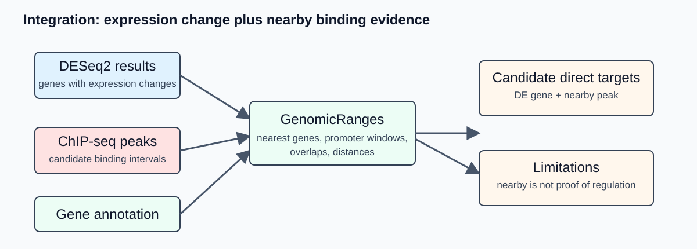

## Overview

Day 4 combines RNA-seq and ChIP-seq outputs. Students connect differential expression results to nearby ChIP-seq peaks, produce interpretable figures and prepare a concise three-slide lab-meeting summary.

The goal is careful prioritization of candidate regulatory relationships, not overstatement. A ChIP-seq peak near a differentially expressed gene is a candidate direct regulatory link that depends on the assumptions and quality of the data.

## Today's path: how your repository grows

{#fig-integration-concept-flow width="100%" fig-alt="Integration workflow combining differential expression, peaks and gene annotation to generate candidate direct targets."}

```text
DESeq2 result table
  + Day 3 consensus ChIP-seq peak file
  + Day 3 differential peak result table
  + genome annotation
  -> genomic interval objects
  -> peak-to-gene table
  -> DE genes with nearby peaks
  -> summary plots
  -> final three slides
  -> final commit and push
```

## Learning outcomes

By the end of Day 4, students should be able to:

- explain genomic intervals and coordinate-system pitfalls;
- import DESeq2 results, peak files and gene annotations;
- compute nearest-gene and promoter-overlap annotations;
- distinguish candidate direct and indirect regulatory effects;
- create interpretable summary plots;
- document limitations of RNA-seq and ChIP-seq integration;
- prepare a three-slide presentation of data, workflow and biological interpretation.

## Before you start

Open the same `workshop_ngs` repository that you used on Day 1.

- Windows users should open Visual Studio Code connected to Ubuntu WSL, open a WSL terminal, and run the commands there.
- macOS and Linux users should open the `workshop_ngs` folder in Visual Studio Code and use the VS Code terminal or a normal terminal.
- Before running commands, move to the repository root:

```bash
cd ~/workshop_ngs
pwd
```

If your repository is stored somewhere else, replace this path with the location of your own `workshop_ngs` folder. The command `pwd` should end with `workshop_ngs`.

Use your own outputs or checkpoint files:

```text
results/day2_rnaseq/deseq2/deseq2_results.tsv
results/day3_chipseq/peaks/consensus/day4_consensus_peaks.bed
results/day3_chipseq/counts/consensus_peak_counts.tsv
results/day3_chipseq/differential_peaks/differential_peak_results.tsv
reference_genome/annotation.gff3
raw_data/metadata/samples.csv
```

If checkpoint files are used, record their source in `scripts/day4_integration/execution_note.md`.

Before integration, verify that the annotation and Day 3 BED file both use chromosome `NZ_AP026446.1`:

```bash
grep -v '^#' reference_genome/annotation.gff3 | head -1
head -1 results/day3_chipseq/peaks/consensus/day4_consensus_peaks.bed
```

Day 4 must stop rather than translate or guess coordinates if any input was generated against another assembly.

## Time plan

| Part | Topic | Target time |
|---|---|---:|
| 1 | Genomic interval theory | 35 min |
| 2 | Import RNA-seq, ChIP-seq and annotation | 35 min |
| 3 | Peak-to-gene annotation | 55 min |
| 4 | DEG and peak integration | 55 min |
| 5 | Figures and final slides | 90 min |
| 6 | Final commit | 15 min |

## Conceptual background

### Genomic intervals

A genomic interval is a feature on a sequence coordinate system:

```text
sequence name, start, end, strand, metadata columns
```

Examples include genes, CDS features, promoters, ChIP-seq peaks, read alignments and motif matches. Most integration problems in genomics reduce to operations on intervals.

An interval $A$ can be represented as:

$$
A = (chr_A, start_A, end_A, strand_A)
$$

Two intervals on the same chromosome overlap when:

$$
start_A \le end_B \quad \text{and} \quad start_B \le end_A
$$

In software, exact definitions depend on whether coordinates are one-based closed intervals or zero-based half-open intervals. This is why file formats matter.

### Coordinate systems and file formats

| Format | Common convention | Practical warning |
|---|---|---|
| GFF3/GTF | one-based, closed | gene annotations usually use this |
| BED/narrowPeak | zero-based, half-open | MACS peak outputs are BED-like |
| BAM/SAM | one-based leftmost alignment position in SAM display | tools handle this internally |
| bigWig | indexed genome coverage | mostly used for visualization |

Most R/Bioconductor import functions handle common formats correctly. Problems usually arise when files come from different genome assemblies or use inconsistent chromosome names.

::: {.callout-important}
Never integrate RNA-seq genes and ChIP-seq peaks unless the genome assembly and sequence names are consistent.
:::

### Peak-to-gene annotation is a rule, not proof

There are several reasonable ways to associate peaks with genes:

| Strategy | Biological question | Limitation |
|---|---|---|
| nearest gene | Which gene is closest to each peak? | closest is not always regulated |
| promoter window | Is the peak near a likely promoter? | promoter boundaries may be uncertain |
| overlap with gene body | Does the peak overlap an annotated feature? | TFs often bind outside coding regions |
| distance to TSS | How close is binding to transcription start? | TSS annotation may be incomplete |

For bacteria, promoter-proximal binding is often informative, but operons and divergent promoters complicate interpretation. A peak between two genes may regulate either, both or neither.

In bacterial genomes, annotation may also list genes rather than true transcription start sites. That means "nearest gene" and "nearest promoter" are practical approximations. They are useful for prioritization, but they should be reported as assumptions in the final interpretation.

### Promoter windows and strand

For a gene on the positive strand, a simple promoter window might be:

$$
[start - 500,\ start + 100]
$$

For a gene on the negative strand, transcription starts at the higher coordinate, so the corresponding window is:

$$
[end - 100,\ end + 500]
$$

The exact values are assumptions. In a teaching analysis, a fixed window such as 500 bp upstream and 100 bp downstream is acceptable if it is clearly documented.

### Integrating DESeq2 and ChIP-seq results

RNA-seq and ChIP-seq provide different evidence:

| Evidence | What it supports |
|---|---|
| RNA-seq differential expression | gene expression changes between conditions |
| ChIP-seq peak | protein occupancy or enrichment at genomic region |
| motif in peak | sequence pattern compatible with binding |
| peak near DE gene | candidate direct regulatory relationship |

A useful classification is:

```text
DE gene with nearby peak       -> candidate direct target
DE gene without nearby peak    -> candidate indirect effect or missed binding
peak near non-DE gene          -> binding without detected expression change
neither DE nor nearby peak     -> no evidence in this experiment
```

This classification is a hypothesis-generating summary. Biological validation or independent evidence is required for strong mechanistic claims.

### Visualization principles

Good final figures should answer specific questions:

| Question | Useful plot/table |
|---|---|
| Did replicates behave as expected? | PCA or sample-distance plot |
| Which genes changed? | MA plot, volcano plot, top DEG table |
| How many peaks were called? | Day 3 peak-count table and consensus peak summary |
| Where are peaks relative to genes? | distance-to-gene histogram |
| Which DE genes have nearby peaks? | candidate direct target table |
| What does one locus look like? | genome-browser track snapshot |

For the final three slides, prefer a small number of clear plots over many partially explained figures.

## What the tools are doing

### rtracklayer

`rtracklayer` imports genomic file formats such as GFF3, GTF, BED, narrowPeak and bigWig into R/Bioconductor objects. It preserves coordinates and metadata columns when possible.

### GenomicRanges

`GenomicRanges` represents genomic features as interval objects. Core operations include:

| Operation | Typical function | Question |
|---|---|---|
| overlap | `findOverlaps()` | Which intervals intersect? |
| nearest neighbor | `nearest()` / `distanceToNearest()` | Which gene is closest to each peak? |
| resize/extend | `resize()`, `flank()` | What is the promoter region? |
| set operations | `intersect()`, `union()`, `setdiff()` | How do interval sets compare? |

The advantage of using interval-aware objects is that chromosome names, ranges and strand can be handled explicitly rather than through ad hoc spreadsheet operations.

### dplyr / ggplot2

After interval operations, many outputs become regular tables: peak ID, nearest gene, distance, log2 fold change, adjusted p-value and annotation category. `dplyr` is useful for filtering and joining these tables. `ggplot2` is useful for producing final plots.

## Guided demonstration

In the guided demonstration, you will see:

- importing a DESeq2 result table;
- importing the Day 3 consensus BED peak file;
- importing GFF3 annotation;
- converting gene features into genomic intervals;
- computing nearest genes to peaks;
- linking peak-associated genes to DESeq2 results;
- selecting one result suitable for the final presentation.

## Hands-on practical

Create folders:

```bash
mkdir -p scripts/day4_integration
mkdir -p results/logs/day4
mkdir -p results/day4_integration/tables
mkdir -p results/day4_integration/plots
mkdir -p slides
```

Create `scripts/day4_integration/execution_note.md` in VS Code and paste:

```markdown
# Day 4 execution note

## Inputs used
- DESeq2 table:
- Day 3 consensus peak file:
- optional Day 3 peak-count table:
- annotation file:
- checkpoint files, if any:

## Integration rules
- nearest gene:
- promoter window:
- adjusted p-value threshold:
- log2 fold-change threshold:

## Limitations
-
```

## R script for interval integration

The maintained `scripts/day4_integration/peak_gene_integration.R` is authoritative. It checks sequence-name compatibility, applies the documented promoter window, joins RNA-seq and differential ChIP-seq results, and writes the tables and plots listed below. The following excerpt introduces the core interval objects; do not maintain a second independent copy of the script.

```r
#!/usr/bin/env Rscript

suppressPackageStartupMessages({
  library(GenomicRanges)
  library(rtracklayer)
  library(tidyverse)
})

# Inputs
peak_file <- "results/day3_chipseq/peaks/consensus/day4_consensus_peaks.bed"
annotation_file <- "reference_genome/annotation.gff3"
deseq_file <- "results/day2_rnaseq/deseq2/deseq2_results.tsv"
out_dir <- "results/day4_integration/tables"

if (!file.exists(peak_file)) {
  stop("Peak file not found: ", peak_file)
}
if (!file.exists(annotation_file)) {
  stop("Annotation file not found: ", annotation_file)
}
if (!file.exists(deseq_file)) {
  stop("DESeq2 result file not found: ", deseq_file)
}

dir.create(out_dir, recursive = TRUE, showWarnings = FALSE)

# Import data
peaks <- import(peak_file, format = "BED")
annotation <- import(annotation_file)
de <- read_tsv(deseq_file, show_col_types = FALSE)

# Keep gene-like features. Adapt this line to the organism annotation.
genes <- annotation[annotation$type %in% c("gene", "CDS")]
if (length(peaks) == 0) {
  stop("No peaks were imported from: ", peak_file)
}
if (length(genes) == 0) {
  stop("No gene or CDS features were imported from: ", annotation_file)
}

# Create stable gene identifiers from available metadata.
gene_id <- mcols(genes)$gene_id
if (is.null(gene_id)) gene_id <- mcols(genes)$ID
if (is.null(gene_id)) gene_id <- mcols(genes)$locus_tag
if (is.null(gene_id)) gene_id <- paste0("gene_", seq_along(genes))
mcols(genes)$gene_id <- as.character(gene_id)

# Nearest gene per peak. Peak intervals are unstranded, so ignore strand here.
nearest_hits <- distanceToNearest(peaks, genes, ignore.strand = TRUE)
peak_gene <- tibble(
  peak_index = queryHits(nearest_hits),
  gene_index = subjectHits(nearest_hits),
  distance_to_gene = mcols(nearest_hits)$distance,
  gene_id = mcols(genes)$gene_id[subjectHits(nearest_hits)],
  peak_chr = as.character(seqnames(peaks))[queryHits(nearest_hits)],
  peak_start = start(peaks)[queryHits(nearest_hits)],
  peak_end = end(peaks)[queryHits(nearest_hits)]
)

write_tsv(peak_gene, file.path(out_dir, "peak_nearest_gene.tsv"))

# Join with DESeq2 results. Adapt the gene ID column if needed.
if (!"gene_id" %in% names(de)) {
  first_col <- names(de)[1]
  de <- de %>% rename(gene_id = all_of(first_col))
}
de <- de %>% mutate(gene_id = as.character(gene_id))
combined <- peak_gene %>%
  left_join(de, by = "gene_id") %>%
  mutate(
    is_de = !is.na(padj) & padj < 0.05 & abs(log2FoldChange) >= 1,
    is_nearby = distance_to_gene <= 500,
    candidate_class = case_when(
      is_de & is_nearby ~ "DE gene with promoter-proximal peak",
      TRUE ~ "Nearby peak without DE evidence"
    )
  )

write_tsv(combined, file.path(out_dir, "peak_gene_deseq2_join.tsv"))
```

Run the script you just saved:

```bash
docker run --rm \
  --platform linux/amd64 \
  -v "$PWD:/work" \
  -w /work \
  docker.io/fgualdr/ngs-r-bioc:latest \
  Rscript scripts/day4_integration/peak_gene_integration.R \
  2>&1 | tee results/logs/day4/01_peak_gene_integration.log
```

## Outputs and plots

The authoritative script creates the distance histogram, candidate table, and—when the Day 3 differential peak table is available—the RNA-versus-ChIP change quadrant plot in one run. Use the snippets below only to explore the tables interactively.

Distance-to-gene plot:

```r
library(tidyverse)

peak_gene <- read_tsv("results/day4_integration/tables/peak_nearest_gene.tsv")

ggplot(peak_gene, aes(x = distance_to_gene)) +
  geom_histogram(bins = 40) +
  labs(
    x = "Distance from peak to nearest gene (bp)",
    y = "Number of peaks",
    title = "Peak-to-gene distance distribution"
  ) +
  theme_bw()

ggsave("results/day4_integration/plots/peak_gene_distance_histogram.pdf", width = 7, height = 5)
```

Candidate-target table:

```r
combined <- read_tsv("results/day4_integration/tables/peak_gene_deseq2_join.tsv")

candidate_targets <- combined %>%
  filter(!is.na(padj), padj < 0.05, abs(log2FoldChange) >= 1, is_nearby) %>%
  arrange(padj, desc(abs(log2FoldChange)))

write_tsv(candidate_targets, "results/day4_integration/tables/candidate_direct_targets.tsv")
```

## Final three slides

Prepare three slides in `slides/final_summary.qmd` or another slide format assigned for the course.

```text
Slide 1 - Data and design
  organism, biological question, conditions, replicates, public accessions or checkpoint source

Slide 2 - Workflow and quality control
  execution route, main commands/tools, QC summary, mapping/counting or peak-calling summary

Slide 3 - Biological result and limitation
  one key RNA-seq or ChIP-seq result, integration summary, one limitation and one next step
```

Avoid filling slides with command lines. Commands belong in the repository. Slides should communicate design, evidence and interpretation.

## Checkpoint route

Checkpoint mode is acceptable if documented. Include:

```text
which files were provided
which steps were demonstrated but not run locally
which analyses were run by the student
how the checkpoint files relate to the full workflow
confirmation that every checkpoint uses GCF_025998455.1
```

The final repository should make it clear whether the student performed:

```text
full local execution
partial local execution
university-machine execution
checkpoint-based downstream analysis
```

## Expected outputs

Commit small outputs:

```text
scripts/day4_integration/
results/logs/day4/
results/day4_integration/tables/
results/day4_integration/plots/
slides/final_summary.qmd or exported PDF
README.md updated with final workflow summary
```

Do not commit large binary tracks unless instructed:

```text
*.bam
*.bai
*.bw
*.bigWig
```

## Final repository checklist

Your repository should contain:

- a clear `README.md` with biological question, dataset, tools and execution route;
- metadata tables for RNA-seq and/or ChIP-seq;
- accession tables or checkpoint provenance;
- scripts or clearly documented commands;
- `.gitignore` excluding large sequencing files;
- logs or summaries from executed steps;
- DESeq2 or peak-calling result tables;
- integration tables or plots when relevant;
- final three-slide summary;
- a short limitations section.

## Final commit

```bash
git add README.md scripts/day4_integration results/logs/day4 results/day4_integration slides
git commit -m "Add Day 4 integration and final presentation"
git push
```

## Self-check questions

1. What coordinate-system assumptions are involved when combining GFF3 and BED-like peak files?
2. Why is nearest-gene annotation not equivalent to proof of regulation?
3. How does promoter-window analysis differ for positive- and negative-strand genes?
4. What evidence supports a candidate direct target?
5. Which result from your analysis would be most convincing in a lab meeting?
6. What is the most important limitation of your analysis?

## Common problems

| Symptom | Likely cause | Check |
|---|---|---|
| No shared sequence names | Reference, annotation, and peaks use different assemblies or chromosome labels | FASTA headers, GFF3 column 1, and BED column 1 |
| Most joined RNA values are missing | `gene_id` values differ between featureCounts and the annotation | First column of the DESeq2 table and GFF3 `ID`/`gene_id` attributes |
| ChIP-change columns are empty | Day 3 differential peak analysis was skipped or used different peak IDs | `differential_peak_results.tsv` and `day4_consensus_peaks.bed` |
| Quadrant plot is absent | No matched finite RNA and ChIP log2 fold changes were available | The joined integration table |

## How to report issues

If you have a GitHub account, report Day 4 problems by opening an **Issue** in your student repository.

Include:

- `Day 4` and the step number in the issue title;
- your operating system;
- whether you used full local execution or checkpoint mode;
- the command you ran;
- the exact error message;
- the relevant log file, for example `results/logs/day4/01_peak_gene_integration.log`.

If you cannot create or access a GitHub account, email:

```text
francesco.gualdrini@gmail.com
```

Use email only for GitHub account/access problems. Use GitHub Issues for workshop technical questions whenever possible.
